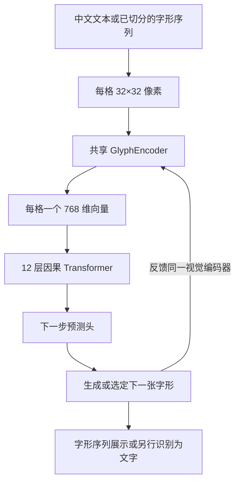
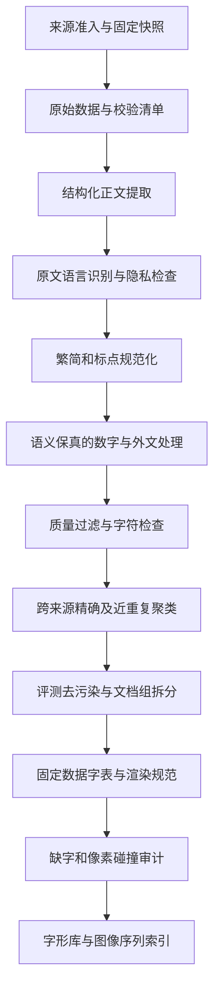

# HansGPT：以 32×32 字形为输入的语言模型与数据方案

日期：2026-09-07。状态：设计提案，尚未实现新模型、下载新语料或启动训练。

## 1. 推荐决策与研究边界

已确定的主架构是 **32×32 字形格子 → 共享视觉编码器 → 字形 embedding → 因果 Transformer**。每个格子占一个语言序列位置，正文输入完全来自像素，不使用字符 ID embedding，也不把字符 embedding 与视觉特征相加。

已经确定的输入契约：

- 模型接收 `glyphs: [batch, sequence, 1, 32, 32]`，第一版沿用项目二值图约定，背景为 0、笔画为 1；灰度作为独立消融。
- 同一个视觉编码器处理所有格子，产生 `[batch, sequence, hidden_size]`，再交给从零训练的语言骨干。
- 字符 ID、码点、读音、部首、IDS 和字符类别都不能成为主模型的输入特征。文件索引与监督标签可以存在，但不能绕过像素直接产生输入 embedding。
- 一字一格、一格一个外层 Token。格子内部的卷积位置不计入语言模型的上下文长度。

继续沿用的数据假设：

- 内容字符允许汉字、明确列举的中文标点和换行；不保留拉丁字母、阿拉伯数字、代码、表情。
- 以现代简体中文为主，数字在能可靠解释语义时转换为中文数字。
- 沿用已有实验记录中的训练服务器 RTX 5060 Ti 16GB 作为起步硬件，实际吞吐和显存必须重新实测。

本次需求明确了输入形式，尚未限定输出必须是字符分类还是直接生成点阵。第 3 节给出两条输出路线；二者都遵守相同的纯字形输入约束。直接生成下一格可延续已有字形研究，字符分类头仅作为验证输入表示的可选对照。

原来的 [研究方案](RESEARCH_PLAN.md) 研究冻结预训练模型中的字形可解码性。新方案训练视觉编码器、骨干和输出层，是另一条实验路线。原有冻结骨干、单线性输出头和字符不重叠评测仍适用于原探针实验，不能用它们约束新语言模型的全部训练。

[诊断报告](GLYPH_BOTTLENECK_DIAGNOSTIC_REPORT.md) 中，已见字的 MLP 重建很强，但未见字身份检索很弱。直接输入字形能向模型提供真实笔画和布局信息，不过字形相似不等于语义相似，仍需通过中文上下文学习语义。不能由输入形式直接推断未见字理解能力。

以下边界需要分别记录：

| 层面 | 本方案如何满足 | 能说明什么 |
|---|---|---|
| 输入形式 | 所有正文格子通过共享视觉编码器 | 输入表示只由像素决定 |
| 输出约束 | 分类路线限制字符集合；直接点阵路线评测字形合法率 | 任意像素生成不能保证一定是合法汉字 |
| 训练语料纯度 | 原文语言识别、中文清洗、最终字符校验和人工抽检 | 对语料语言和字符组成提供证据 |
| 预训练来源纯度 | 所有语言模型参数随机初始化，只用本项目中文训练集 | 不继承已有多语言骨干的训练历史 |

只有汉字并不等于一定是中文，日文也使用汉字。字符约束不能替代语言识别。只裁剪 Qwen 的词表并继续训练，可以得到中文输出受限的模型，但不能称为仅以中文从零预训练的模型。

## 2. 字形格子与数据字表

### 2.1 以格子为单位的编码

文本语料先规范化和按 Unicode 码点切分，再用确定性渲染器形成格子。模型本身直接接收格子，也可接收外部已经切好的 32×32 图像序列。例如：

```text
输入：春风吹过山林。
渲染：[春的图] [风的图] [吹的图] [过的图] [山的图] [林的图] [。的图]
张量：[7, 1, 32, 32]
编码：[e_春] [e_风] [e_吹] [e_过] [e_山] [e_林] [e_。]
向量：每个 e 均由该格子像素通过同一个 CNN 计算
```

这里没有 BPE、OCR 后的字符查表或字节回退，也不把 1024 个像素各自变成一个外层语言 Token。格子内二维位置由 CNN 保留，格子间顺序由 Transformer 的 RoPE 表示。页面截图或连写手稿需要另外的切字模块，不属于当前已切格子输入契约。

### 2.2 字表的职责

保留数据字表，用于语料准入、渲染资产索引、统计、标签和评测。它不是一个可训练的 `Embedding(V, D)`。可从约 8K～16K 个规范字符开始，但视觉编码器的参数量不依赖字符数量。

1. 以官方《通用规范汉字表》的 8,105 字建立核心集合。
2. 在完成来源分组和训练集拆分之后，只从训练文本统计补充字频，加入真实出现的姓名、地名和领域用字。
3. 用固定版本 Unicode/Unihan 校验码点和元数据；候选识别使用 `Unified_Ideograph` 等正式属性，并显式处理 `〇`，不能只匹配 `\u4e00-\u9fff`。
4. v1 采用固定版本 OpenCC `t2s` 配置，保留原文和转换记录。简繁转换并非完全无损，专名和歧义映射要抽检。繁体原样生成可作为后续独立版本。
5. 标点采用显式清单，例如 `，。！？；：、（）《》〈〉“”‘’「」『』【】〔〕…—·`，加换行；清单需包含清洗器可能产生的全部符号。
6. 内容字符按固定规则排序并写入 `character_inventory.json`；保存字符类别、码点、来源、频次和版本。资产索引发布后保持稳定，但不会作为输入特征。
7. 每个条目引用 `glyph_bank` 中的 32×32 图像，并记录字体、渲染版本、像素哈希、缺字和碰撞状态。

如果选择字符分类输出，可独立设置约 16K 类的输出字表并屏蔽未使用类别。直接点阵输出没有固定字符类别 softmax，因此也没有由有限输出字表自动保证的汉字合法性。

数据字表可以通过显式新版本扩展，而不扩展输入编码器的参数矩阵。分类输出字表扩展仍涉及分类头和标签迁移；二者必须区别记录。

可接收未见字的图像，不等于已经学会它的读音、词义或上下文用法。需单列训练频次为零或极低的字符，不能把图像可编码当成语言能力覆盖。

### 2.3 渲染、控制格子与输入契约

- 固定字体文件、SHA-256、字号、FreeType/Pillow 版本、画布、基线、阈值和裁剪规则。第一版以 Noto Sans CJK SC Regular 的固定字体二值图为主。
- 当前 `glyph_probe.py` 的 `render_glyph` 按每个字符的笔画边界居中，适合原汉字探针，但新的语言输入应采用固定基线和字框，专门检查逗号、句号、引号等的相对位置；不要直接把旧探针图像当作已验证的语言输入资产。
- 检查裁切笔画、全空图、缺字方框和完全相同的像素哈希。若两个字符在 32×32 上完全相同，在相同上下文下纯像素输入无法区分它们；需要记录歧义，必要时隔离或作为等价类评测，不能添加字符 ID 来掩盖。
- 字体不支持的字符不能在主模型中退回字符 embedding。文本入口报告无法渲染的具体码点，训练句段隔离；外部已提供的有效图像仍能进入编码器，识别和语义正确性另评测。
- `BOS`、换行和对话控制等使用固定、互异、与正文图像不碰撞的 32×32 控制格子，并通过同一个 CNN。`PAD` 可为全零格子，但必须用 attention 和 loss mask 排除，换行不能也用空白格子。
- 控制格子不显示为正文，也不含对应英文名称；由结构化接口构造，用户正文不能直接触发协议控制。mask 和位置索引只控制计算，不携带字符身份。
- 直接生成路线可设置控制事件头区分“内容格子、换行、结束”等；事件转成对应格子后仍走同一输入编码器。特殊事件数量固定，不是汉字词表。
- 实现按 Unicode 码点切分文本，尤其 JavaScript 不能拆开扩展区汉字的 UTF-16 代理对。图像入口仅要求格子尺寸、极性、范围和序列约定正确。

文本与资产索引的往返可以无损；单凭图像还原 Unicode 则不保证一一对应。报告字体覆盖、缺字率、碰撞率、受影响句段和各领域分布，不能删除失败样本后宣称百分之百可表示。

第一版固定字体以控制变量，后续单独测试新字体和灰度输入。不随机翻转或旋转汉字；平移、轻微形变等增强也必须验证不会改变身份。保留 32×32 主规格，分辨率造成的不可区分是需要报告的限制。

如果要求连标点都不能有，应另建严格汉字语料和模型配置，只保留不可见文档结束控制。直接删除标点会损失断句、引用和语气信息；不能把两种训练结果混为同一实验。

## 3. 模型架构

### 3.1 HansGPT-Glyph 主干



核心数据流：

```text
G: [B, T, 1, 32, 32]
e[t] = GlyphEncoder(G[t])          # 只处理当前位置格子
E: [B, T, 768]
H = CausalTransformer(E)           # h[t] 只依赖 G[:t+1]，含当前位置
Head(h[t]) -> 下一字的监督分布
```

主模型不包含用于正文的 `E_char[id]`。也不先 OCR 为字符再查 embedding。字符身份可作为训练标签帮助网络学习，但推理输入的每个向量必须从对应像素算出。

### 3.2 共享视觉编码器

第一版用小型 CNN，保留二维空间位置，不一开始引入大型通用视觉模型：

| 步骤 | 输出形状，每格 | 配置 |
|---|---|---|
| 输入 | `1×32×32` | 背景 0，笔画 1 |
| 卷积一 | `32×32×32` | kernel 3，stride 1，padding 1 |
| 卷积二 | `64×16×16` | kernel 3，stride 2，padding 1 |
| 卷积三 | `128×8×8` | kernel 3，stride 2，padding 1 |
| 卷积四 | `128×4×4` | kernel 3，stride 2，padding 1 |
| 展平 | `2048` | 保留各空间位置，避免全局平均丢失布局 |
| 投影 | `768` | `Linear(2048, 768)` |
| 归一化 | `768` | RMSNorm |

每层卷积后使用按单个格子统计的 GroupNorm，8 组，以及 SiLU；卷积与投影不带 bias。该 Base 编码器约 1.81M 参数，是可训练的起步配置，需验证细笔画和相似字可分性。

编码器对 `B*T` 个格子独立执行，禁止沿序列进行非因果混合。尤其不能使用跨格子统计的 BatchNorm：训练时它可能把未来格子的信息带入前缀，且与逐格生成时的统计不一致。句子长度、未来字符或整段图像不能进入当前格子的归一化。

编码器与 Transformer 默认联合训练。字形自编码器预热是可选初始化，不替代语言训练；若使用预热，明确其字符、字体和监督范围。主实验不加入读音、IDS 或独立字符向量输入。

### 3.3 因果语言骨干与规模

每层采用：

```text
x = x + GQA(RMSNorm(x), RoPE, causal_mask)
x = x + SwiGLU(RMSNorm(x))
```

| 配置 | Tiny | Base，推荐首个正式实验 | Medium，后续扩展 |
|---|---:|---:|---:|
| 层数 | 8 | 12 | 24 |
| 隐藏维度 | 512 | 768 | 1024 |
| Query 头数 | 8 | 12 | 16 |
| KV 头数 | 2 | 4 | 4 |
| 每头维度 | 64 | 64 | 64 |
| FFN 中间维度 | 1408 | 2048 | 2816 |
| 语言骨干参数 | 22.55M | 75.52M | 270.58M |
| 视觉编码器参数 | 1.29M | 1.81M | 2.34M |
| 编码器＋骨干，不含输出头 | 23.84M | 77.33M | 272.92M |
| 初始训练长度 | 512 | 1024 | 1024 |
| 验证后扩展长度 | 1024 | 2048 | 2048～4096 |

上述参数估算包含各层和最终 RMSNorm，不包含字符嵌入矩阵。输出头单独计数：如果采用 16,384 类的无 bias 字符分类头，Base 增加约 12.58M，总计约 89.91M；如果采用点阵生成头，总量取决于所选解码器，不能直接沿用原来的 88M 总量。

复用项目已有 Transformers 的 Llama 因果层、GQA、RoPE 和 KV cache，通过 `inputs_embeds` 接入视觉向量。构造包装模型时移除不参与计算的字符 embedding 模块，接口拒绝正文 `input_ids`；仅传 `inputs_embeds` 而仍计入庞大的闲置词嵌入会误报参数量。

骨干、视觉编码器和预测头均随机初始化。不存在输入字符矩阵可与输出头绑定，所以不能继续使用原方案的 `tie_word_embeddings=True`。需核对锁定版本的模块、保存加载和 KV cache 行为。

### 3.4 输出路线一：直接生成下一格

这一路线形成像素到像素的闭环：

```text
h[t] -> 条件字形生成器 -> G_hat[t+1]: [1, 32, 32]
G_hat[t+1] -> 同一个 GlyphEncoder -> 下一个语言序列位置
```

训练时用真实前缀 `G[:t+1]`，目标是下一格 `G[t+1]`。例如输入“春、风、吹”的三张图，第三个位置预测“过”的图；预测位置不能提前输入目标字形。生成时从已生成格子重新编码，用 KV cache 延续语言序列，不依赖 Unicode 或 OCR 才能反馈。

用于烟测的最小输出头可采用 `Linear(D, 1024)`，或保留空间结构的小型卷积上采样 decoder。二值图训练用 BCE logits；前景加权和 Dice 可以作为重建实验设置。该配置用于检查梯度、标签对齐和小样本容量。

但正式自由生成必须处理下一字的多种可能。例如“我喜欢”之后有许多合法续字，单个确定性向量回归、逐像素独立 BCE 或 latent MSE 都可能得到混合轮廓；增加 decoder 容量不能自动消除这种多峰分布问题。

一个明确且可训练的参考输出分布是以 `h[t]` 为条件的 PixelCNN 类像素自回归解码器：

```text
p(G[t+1] | h[t]) = product_j p(pixel[j] | pixel[:j], h[t])
L_next = -mean(log p(G[t+1] | h[t]))
```

局部 decoder 在字内建模笔画依赖，外层 Transformer 仍是一字一个位置。训练时局部像素使用严格掩码并可并行算损失；生成时逐像素采样，最多 1024 个局部步骤，延迟很可能成为瓶颈，需独立测量。它是已有概率建模路线，不能把它与一次预测全部独立像素混为一谈。

后续可比较条件 VQ 图像码或其他随机生成器以减少局部采样步骤，但必须先证明字形编解码保持字符身份。图像局部码不等于汉字 ID；无论字内如何生成，反馈给外层的仍是一张 32×32 格子。正式概率模型使用其对应的似然或训练目标，不能把加权 Dice 当作规范化概率。

内容生成和控制事件预测分别计算损失，控制格子不需要神经网络逐像素重画。直接生成的内容格子可能是非法字形，必须报告合法率、身份、笔画质量和长序列误差积累。若加入最近合法字形投影，需单列为受候选库约束的生成，不能用它证明开放字形组合能力。

### 3.5 输出路线二：字符分类诊断

为单独验证“由字形得到的输入表示是否能学好语言”，可暂用普通字符分类输出头：

```text
p(c[t+1] | G[:t+1]) = softmax(W_out * h[t])
L_char = CE(logits[t], next_char_label[t])
采样字符 -> 固定渲染器或 glyph_bank -> 32×32 图 -> GlyphEncoder
```

分类目标保留下一字的离散多种可能，便于用成熟语言指标判断视觉输入是否有效。该路线依然没有输入字符 embedding，但它只能输出分类字表中的字符，渲染出来的图也不是模型自主画出的图。不得将该对照替代为用户已选定的最终输出目标。

### 3.6 因果性、反馈与监督边界

- 显式定义位置对齐：`BOS` 预测第一格，每个正文格预测下一格，最后一格预测结束事件；PAD 和无效位置不计损失，不在框架内外重复右移标签。
- 下一格图像和身份可以作为标签，但不能进入当前位置的 GlyphEncoder 或语言骨干。局部像素 decoder 训练时使用目标的已生成部分，是字内 teacher forcing，不是把完整目标提前送入语言骨干。
- 输入灰度分布、阈值和生成反馈策略要一致。二值输入模型不能在未训练适配时直接反馈 sigmoid 概率图；逐像素采样和固定阈值反馈是不同策略，应明确配置。
- 字形自重建只验证编码器保留信息，不验证语义或续写；“输入目标图然后重建”不能计为下一字预测。
- 教师强制评测和自由运行评测同时报告。逐格生成要验证完整前向与 KV cache 增量前向的一致性，防止绕开视觉编码器或复用错误位置。
- 纯字形模型参数共享可提供结构归纳偏置，但有限训练仍可能记忆常见整字。部件组合、新字体和未见字符必须各自设立对照，不由模型命名代替证据。

## 4. 数据来源与采集策略

### 4.1 候选来源

以下为 2026-09-07 核对的官方入口。除已确认的页面和元数据外，不把可用量或清洗后规模当成已验证事实。

| 来源 | 主要用途 | 采集与使用边界 |
|---|---|---|
| [中文维基百科](https://dumps.wikimedia.org/zhwiki/) | 百科、说明文、知识性叙述 | 固定日期的正文 XML dump；记录页面和修订；保留归属及适用许可 |
| [中文维基文库](https://dumps.wikimedia.org/zhwikisource/) | 合适的公版作品、历史材料、长篇结构 | 逐作品确认原作、翻译和版本权利；不能把全部作品当公版 |
| [中文维基教科书](https://dumps.wikimedia.org/zhwikibooks/) | 中文教程和解释性文本补充 | 量级以实际抽样为准；保留来源和许可 |
| [FineWeb2](https://huggingface.co/datasets/HuggingFaceFW/fineweb-2)，`cmn_Hani` | 扩展现代中文网页覆盖 | 固定 revision，选择中文分片；重新执行本项目清洗、语言识别、隐私过滤和去重 |
| 自有或明确授权的中文书籍、问答、说明书 | 弥补口语、长文和专业领域缺口 | 保存授权范围、版本、文档来源和再分发条件 |

FineWeb2 官方卡片确认普通话中文分区为 `cmn_Hani`，不是 `zh` 或未经核实的 `cmn_Hans`。其数据集许可为 ODC-By 1.0，同时受 [Common Crawl 使用条款](https://commoncrawl.org/terms-of-use) 约束；这不等于原网页内容的著作权全部开放。按来源和用途建立可用清单，无法满足项目使用条件的材料进入隔离区。

官方卡片也明确指出中文上存在表现更好的其他语料，并披露其电话隐私过滤等局限。因此选它作为可复现候选池，不预设它是质量最好的中文训练集，也不认为上游清洗已经解决中文纯度和隐私问题。

首轮优先使用有清晰使用依据的材料。百度百科、付费书库、未经授权的社区问答不能因能访问就自动纳入。现有中文维基规模适合验证管线，能否支撑目标训练量须实际统计，不能靠重复它来填满规模指标。

### 4.2 直接下载到训练服务器

先本地提交并推送代码，再由 `/root/HansGPT` 拉取和 `uv sync --frozen`。本机只读取资料页面和开发代码，不下载语料、模型或创建研究环境。

服务器采集规则：

1. 每个来源先读取清单，记录日期、revision、官方 URL、许可、大小和可用校验值。
2. 先选取约 1,000～10,000 篇用于解析烟测，再分来源抽样，累计约 1,000 万～5,000 万字符用于清洗审计。
3. HTTP 采用重试、退避和支持时的 Range 续传；保留分片状态。校验官方校验和，并另算 SHA-256。
4. Wikimedia 选择已完成的日期快照，检查 `dumpstatus.json`，不把滚动 `latest` 作为实验标识。核对时 `20260901` 的中文维基正文任务状态为 `done`，实际运行前再次检查。
5. FineWeb2 按固定 revision 的文件清单，在不同 crawl 日期和分片间确定性抽样；不要只取流的前若干条，也不要整库下载。
6. 增量采集按来源 ID、修订和原始哈希跳过已处理材料；官方源失败时记录失败，不自动换镜像。

自己抓取网页仅在候选池不足时增加：优先站点官方数据接口、dump、sitemap 或允许的批量入口，遵守站点使用条件、抓取频率和 robots 规则；不绕过访问控制。HTTP 状态、编码、时间和正文提取结果须可追溯。

### 4.3 配比与规模

起始配比按**清洗后实际采样 Token 数**定义，属于目标而非已取得的资源：

| 内容类型 | 初始占比 |
|---|---:|
| 通过审计的现代中文网页 | 40% |
| 百科、科普和解释性内容 | 25% |
| 有使用依据的现代长文、书籍 | 20% |
| 有使用依据的问答和对话 | 10% |
| 古文、诗词等专项材料 | 5% |

同一文档只分配一个主类别，避免重复计数。对话和书籍不足时公布缺口并调整配比，不能用未审核来源或大规模自动生成文本补数。对单站点、作者和作品设置采样上限，限制低质量大站或单部长篇支配训练。

建议 Tiny 先训练 1 亿～3 亿 Token；Base 正式试验目标约 15 亿～30 亿 Token；Medium 暂按约 60 亿～100 亿 Token 规划，先确认数据和算力。以上为起步预算，不是“每参数固定多少字符即可训练好”的定律，字符 Token 与其他模型的 BPE Token 不能直接类比。

分别报告去重后的独立内容量、实际训练呈现量和每来源重复次数。不足时缩小模型或减少预算。这里一个 Token 是一个格子。固定字体可保存 uint16 的图像资产索引：20 亿格的裸索引约 4 GB；若逐位置重复保存 1024 位二值图，则约 256 GB，uint8 图则约 2.05 TB，均未计其他文件。使用图像库加索引避免这种重复，模型前向仍接收像素。

## 5. 清洗流水线



### 5.1 正文提取与语言识别

- XML 使用流式解析器，维基语法使用成熟解析器。只保留适用命名空间的正文；去掉导航、模板、编辑说明、引用标记和无文本表格，保留标题层级和段落边界。
- HTML 使用正文提取库，如 Trafilatura；不能用一条正则去除 HTML 后直接当训练文本。已有提取文本的来源避免二次假装解析 HTML。
- 识别文档、段落的主要语言，并记录中文、日文、韩文和其他语言分数。使用固定版本语言识别器，中文概率阈值先以 0.9 做候选，再用分来源人工标注校准。
- 原文先识别语言，再处理字符，防止删除假名或外文后把外语误判为中文。短句、诗词、古文和专名需要单独抽检规则。
- 在号码和外文规范化前识别邮箱、手机号、身份号码、带个人关联的地址等信息；高置信隐私句段隔离。普通年份、公开地名、人名不能一刀切删除。

### 5.2 规范化与语义保真

保留原文哈希和规范化版本。使用固定 Unicode 版本的 NFC，以及显式标点、宽度、空白映射；NFC 也可能影响部分兼容表意文字，应记录变化。避免对整段不加区分地使用 NFKC。

换行统一，连续空白和页面缩进规范化，保留段落边界；连字符、负号、小数点等先按上下文分类，再决定转换，不能提前全部当标点替换。OpenCC 转换应早于最终数据字表与渲染检查。

数字处理使用可测试的有限语法和成熟数字转换工具，先识别类型，无法判定时隔离：

| 原文片段 | 可接受的处理示例 | 处理条件 |
|---|---|---|
| `2026年` | `二〇二六年` | 明确为年份 |
| `12个人` | `十二个人` | 明确为计数 |
| `3.14` | `三点一四` | 明确为小数 |
| `12%` | `百分之十二` | 明确为百分数 |
| `2026-09-07` | `二〇二六年九月七日` | 已验证为合法日期 |
| `-5℃` | `零下五摄氏度` | 明确为温度 |
| `3/4` | 不直接转换 | 可能是分数、日期或编号 |
| `5G`、`C++`、化学式、型号 | 经审核术语映射或隔离句段 | 不能只删数字和字母 |

不把编号、电话、小数、序号、日期统一逐位改写。不得把不明表达交给模型随意改写后当作原始事实。

外文缩写只有在上下文和词典确认时才替换为中文名称，例如某一上下文中的 `AI` 可映射为“人工智能”。保留规则 ID 和替换记录。词义不确定的句子隔离；独立的英文导航或引用段可以整段去掉。删除段落后保留分隔，不能跨缺口拼成一个句子。

例如 `这个模型支持Python和中文。` 不能简单变成 `这个模型支持和中文。`。若没有经过审核的完整中文表达，则不进入 v1 主训练集。严格字符限制会减少数学、编程、国际专名等领域覆盖，需在数据卡中量化这种损失。

### 5.3 质量和最终字符检查

质量阈值先用于试运行，抽检后固化：

- 现代正文可先以不少于约 50 个汉字、汉字占非空白字符至少约 80% 为候选；短问答、诗词等采用独立规则，不能由通用长度过滤全部删除。
- 检查乱码、替换字符、控制字符、重复导航、关键词堆砌、广告、句段重复、异常标点和异常字符熵。
- 连续相同字符超过约 10 次、重复行比例超过约 30% 等信号进入复核或降权；诗歌、列表等需结合类型判断。
- 不用英文停用词、空格词数或英文词长阈值判断中文。中文近重复和统计使用字符或经过验证的中文切分。
- 最终正文必须百分之百属于规范允许集合，并检查每个字符能否得到有效字形。分类输出路线另检查输出标签覆盖。比例筛选合格不等于像素输入合格。
- 每个处理阶段输出接受数、拒绝数、字符量、原因码、按来源/领域的分布变化和少量可审计样例。

如加入模型质量评分，它只作为经校准的排序信号，不能把“像百科”当成通用质量标准，也不能用最终测试集训练或调节评分器。v1 主语料不依赖大模型批量重写。

### 5.4 去重与防泄漏

1. 原文和规范化正文分别计算 SHA-256，识别原始副本和清洗后相同文档。
2. 使用段落哈希去除模板和复用片段，并限制长篇作品或镜像的重复贡献。
3. 用中文字符 5-gram 的 MinHash/LSH 建立近重复候选，Jaccard 约 0.8 作为初始复核阈值；短文本使用适配规则，避免依赖过少 shingle。
4. 原始与简体规范化视图共同参与聚类，以发现简繁、镜像、转载和格式版本。对聚类中的相邻版本进行质量择优，同时保存全部来源关系。
5. 预先冻结评测题、参考答案和自建测试材料，按精确片段和模糊匹配去除训练重叠；短通用表述不能单凭小片段匹配就删整篇。
6. 按作品、来源文档族和重复簇拆分，例如训练/验证/测试为 98%/1%/1%。同一本书各章节、同一文章各版本和镜像必须同组；比例按组分层并报告实际 Token 比例。
7. 另留整个站点或较晚时间段作为域外集，并清除其与训练集的重复。所有拆分在切块和随机混合之前完成。

固定拆分种子和 manifest，拆分后再次做跨集合近重复审计。验证集用于规则和模型选择；最终测试结果只用于报告。分别报告图像可输入、训练中出现过、分类输出可预测和直接点阵可正确生成的范围，不能用一个 OOV 指标混淆这些能力。

语言建模的主拆分是文档或作品不重叠，而非字符不重叠。把一个汉字从所有语言训练中排除，评测的是零样本词汇问题，不是普通中文生成能力。原来的字符和构件拆分继续单独用于字形研究；字形预热、辅助监督和候选库是否提供测试字图像都要记录。

字形泛化还应按像素哈希分组，避免不同码点的相同图像跨集合；字体泛化按字体文件拆分，构件泛化按部件组合拆分。新字体下认识已见字，与理解从未在语言训练中出现的字，是不同的实验结论。

## 6. 数据存储与训练输入

建议服务器目录如下，均遵守现有 Git 忽略规则：

```text
/root/HansGPT/data/raw/hansgpt/          原始分片、下载清单
/root/HansGPT/data/interim/hansgpt/      解析、隔离、规范化、去重中间表
/root/HansGPT/data/processed/hansgpt/    文本、字形库、拆分、图像序列索引
/root/HansGPT/artifacts/logs/           下载、清洗和训练日志
/root/HansGPT/artifacts/checkpoints/    模型、优化器和续训状态
/root/HansGPT/artifacts/reports/        数据卡、质量报告和评测
```

文档级 Parquet 至少包含：

```text
doc_id, source_id, source_doc_id, source_revision, source_url,
license_id, rights_status, acquired_at, raw_sha256, text_sha256,
text, language_scores, script_variant, domain,
normalization_version, transform_counts, quality_scores,
rejection_reasons, dedup_cluster_id, work_id, split,
char_count, unrenderable_count, glyph_collision_count,
inventory_sha256, glyph_bank_sha256, renderer_version, font_sha256
```

字形库保存每个唯一图像的 bit-packed 像素、哈希、字体和渲染信息；字符到图像资产的映射单独保存。16,384 张二值图的裸像素约 2 MiB，控制格子和元数据另算。码点、读音、部首等字段仅作审计或标签，不参与视觉编码器输入。

训练样本由图像资产索引序列、文档 offset、有效 mask 和与输出路线匹配的标签组成。序列可用 uint16 分片，资产数超过 65,536 时显式切换类型，保存各分片 SHA-256。数据加载器还原并传入 `[B,T,1,32,32]`，不能把索引直接交给可学习 embedding。

固定字体下，同一步中相同图像可去重计算 CNN，再按出现位置 gather 向量；梯度要正确汇总。只有在逐图计算确定且无跨样本统计、无独立随机增强时，这种复用才与逐位置编码等价。编码器还在训练时不能跨优化步骤复用旧 embedding；冻结编码器的缓存实验须明确其权重和数据版本。

采集清单与规范化变更记录允许单独分表引用，URL 和许可等元数据不变成模型输入。私有授权材料标识及审核样例不能直接写入公开仓库。代码、配置、公开的小型 manifest 示例入 Git，实际语料、字形资产、特征、字体、模型和大索引不提交。

训练打包不能把独立文章当作自然连续文本。第一版可按文档分块并 padding；后续使用经过验证的文档边界隔离 attention，文档间不能互相注意，跨文档预测标签也必须屏蔽。仅插入 EOS 不会自动隔离 attention。

若底层高效 attention 内核不支持所需分段掩码，就继续用文档内分块，不能静默回退到跨文档混读。记录长文截断率和有效非 padding Token 比例。相邻长文块可携带固定前缀上下文，但重叠位置的损失不重复计数。

## 7. 训练、算力与推进顺序

### 7.1 建议初始配置

- 视觉编码器、语言骨干和选定的下一步预测头联合训练。先用 PyTorch SDPA，BF16 autocast；参数、梯度和 AdamW 状态精度按实测稳定性明确记录。
- AdamW 起始候选：学习率 `3e-4`、`betas=(0.9, 0.95)`、`weight_decay=0.1`、梯度裁剪 `1.0`；norm/bias 等不衰减参数分组显式配置。
- 约 1%～3% 训练 Token 用于 warmup，随后 cosine decay 至峰值的约 10%；这些是待验证起点，不能当作通用最优值。
- 图像管线先用 128～256 格上下文烟测，之后 Base 尝试长度 1024、micro-batch 1～2。按有效目标格子数累积，有效批量先试约 32K 格。像素损失先按单格定义归一化，再与控制事件损失组合，避免因每格 1024 个像素而无意改变相对权重。
- 需要时启用 activation checkpointing，训练 `use_cache=False`；训练稳定后再试长度 2048，重新测吞吐和显存。
- 不一开始引入 MoE、长上下文、量化训练或多种结构分支，以便识别数据和训练实现的影响。

按 FP32 参数、梯度和两个 AdamW 动量粗算，状态约为每参数 16 字节。Base 编码器＋骨干 77.33M 的状态约 1.15 GiB，输出头状态额外计算。以上不包含 CNN 和语言层激活、字内解码器、logits、临时张量、缓存及额外权重副本；**不能把参数存得下等同于训练一定可行**。

分别记录端到端训练格子/s、自由生成格子/s、图像解码时间和像素内部步数，不能把一个像素或局部码算作一个汉字 Token。举例，20 亿格训练在 1,000、3,000、10,000 格/s 下分别约需 23.1、7.7、2.3 天，仅用于换算，未声称该显卡达到任一吞吐，且未计入评测、保存和中断。

单卡 16GB 适合先验证 Tiny/Base。Medium 是否值得训练取决于实测显存、时间和独立语料量。多十亿参数从零预训练不作为当前第一步。

### 7.2 阶段门槛

| 阶段 | 工作 | 进入下一阶段的条件 |
|---|---|---|
| A：数据与渲染审计 | 小规模清洗，构建字形库、控制格子和碰撞报告；每个主要来源抽检至少约 200 条 | 字形无系统性缺字、裁切和位置错误；来源、清洗和覆盖可追溯 |
| B：输入闭环 | 编码器与小 decoder 做容量检查；Tiny 在短序列上烟测 | 输入只依赖像素；未来格不影响前缀；梯度可达 CNN，标签对齐正确 |
| C：续写验证 | 选定输出路线，先约 500 万～1,000 万格烟测，再按结果扩大 | 下一字能力有效，生成反馈重新经过 CNN，非仅自字符重建 |
| D：正式 Base | 编码器＋骨干约 77M，输出头另计；目标约 15 亿～30 亿格 | 数据量与实测时间可接受，输出分布与自由生成达到前阶段门槛 |
| E：泛化消融 | 同预算比较字形输入和 ID 输入对照；另测字体、稀有字及构件组合 | 区分视觉识别、语义能力和自由字形生成；不得更换主输入目标 |
| F：中文助手 | 单独进行纯中文指令微调 | 训练/测试任务去重，人工评审回答正确性和指令遵循 |

Tiny 可先规划约 1 亿～3 亿格进行数据版本和输出头比较，长训练以前面的烟测结果为门槛，不要求先训练 ID 输入模型。可选分类诊断也始终使用字形输入。

预训练得到的是续写模型，不自动成为聊天助手。指令微调的数据走同一文本和渲染规则；结构化角色在输入中表现为控制格子，通常只在助手回答上计算损失。先规划约 1 万～5 万条审核样本验证流程，再按收益扩大，不默认已有足量合适数据。

长任务在确认服务器 `tmux` 等会话管理器存在后运行。启动前按 AGENTS.md 检查工作区、拉取已提交代码、`uv sync --frozen` 和环境检查；服务器有未提交源代码变化时先检查，不覆盖。每次训练保存 Git 提交、语料和字形库哈希、字体和渲染版本、输出协议、配置、随机种子、软件版本、GPU、精度、采样器及优化器状态。

## 8. 评测与验收

| 维度 | 指标或检查 |
|---|---|
| 输入契约 | 张量形状与极性正确；无字符 embedding 旁路；同像素编码一致；码点仅用于渲染和标签 |
| 渲染质量 | 缺字、全空、笔画裁切、标点位置、像素碰撞率及字体覆盖 |
| 数据质量 | 清洗保留率、语义损坏抽检率、语言误判率、各来源和领域配比 |
| 数据泄漏 | 跨拆分精确重复为零；近重复和评测污染审计；作品与镜像隔离 |
| 分类输出诊断 | 在同一输出字表上的字符 NLL、分领域损失、困惑度和预测准确率 |
| 直接字形输出 | 所选概率模型的下一格 NLL、每像素 bits、合法字形率、身份正确率 |
| 文本生成 | 流畅度、事实一致性、重复率、长程一致性、标点和终止行为，进行固定提示盲评 |
| 中文能力 | 阅读理解、完形填空、纠错、摘要和长文续写；保留任务覆盖及人工检查 |
| 稀有字 | 按训练字频分桶的预测损失与检索/选择任务，单列姓名和地名 |
| 资源 | 训练与自由生成格子/s、局部像素步骤、峰值显存、训练格子总量、墙钟时间和数据重复次数 |
| 字形质量 | 前景 F1、IoU、Dice、完整点阵匹配、最近字形检索及构件拆分结果 |
| 自回归闭环 | 教师强制与自由运行的差距，32/128/512 格续写的身份、合法率和重复率 |

分类输出路线可以与相同标签协议的 ID 输入模型比较字符损失；跨 tokenizer 时，对同一规范文本按相同码点数归一化 log probability，并统一 BOS/EOS 计分约定。直接图像生成的像素似然与字符分类的困惑度不是同一指标，不能直接横比；图像空间包含非法字形，且字符到图像可能碰撞，不能默认图像概率就是规范化的字符概率。

下一字有多个合理答案，参考字像素误差只是配对评测。自由生成还需检查语义合理性，不能把一个合法但不同的续字仅按像素误差判定为语言失败。反过来，最近字形检索总能返回一个候选，也不能代替合法率；需要基于验证集校准的距离/身份判据及人工抽检，原始图和投影后的图分别报告。

可以参考 C-Eval、CMMLU 等中文任务，但含英文、公式或字母选项的题目不能粗暴删改。筛选可表达子集，记录剔除比例；若把选项转成“甲乙丙丁”或转换数字，须标为改编协议，不与原版总分直接横比。

主要对照为共享相同语料、语言骨干和输出头的“字形输入”与“字符 ID 输入”实验，分别报告骨干匹配、总参数和算力成本。ID 输入只是消融对照，不是先行产品路线。还可比较随机冻结 CNN 与可训练 CNN、新字体、图像扰动和低频字，以判断收益来自可训练视觉表示还是记忆。

字符 unigram/n-gram 可作为分类诊断的烟测下限；现有 Qwen 仅作为外部能力参考，不能把其更大的参数量和不同训练历史当成公平结构对照。视觉、语言和字形生成能力分别报告，优先在小模型上做多个种子验证。

## 9. 工程落地范围

建议新增独立包或模块边界，保留现有探针代码：

```text
src/hansgpt_lm/glyphs/           字表、固定渲染、控制格子、字形库和碰撞审计
src/hansgpt_lm/data/             来源适配、清洗、去重、拆分、图像序列加载
src/hansgpt_lm/models/           GlyphEncoder、因果骨干、点阵/分类输出头
src/hansgpt_lm/training/         训练配置、采样、恢复、记录
src/hansgpt_lm/evaluation/       像素与语言计分、生成闭环、泄漏和覆盖报告
configs/hansgpt/                 版本化模型、数据和运行配置
```

这些是待实现路径，不代表当前仓库已有对应命令。实现时优先沿用现有 PyTorch、Transformers、PyArrow、OpenCC、Unicode 和字形工具；按需增加正文提取和去重库，更新 `pyproject.toml` 后使用 `uv lock`。

最先交付的实际模块应是固定渲染与字形库、共享视觉编码器、短序列因果训练和选定输出的生成闭环。必要检查包括：

- 改变资产编号但保持输入像素不变，模型结果不变；不存在字符 ID、字体 ID 或标签进入输入特征的旁路。
- 改变未来格子，前缀表示和预测不变；GroupNorm 按格子执行，文档掩码、标签右移和字内像素掩码正确。
- 语言损失梯度能到达 CNN；同一步图像去重编码与逐位置编码的结果、梯度在数值容差内一致。
- 控制格子互异且与正文无碰撞；缺字、相同像素不同字符和标点基线问题会被报告。
- 生成的下一格确实重新通过 CNN，完整前向与 KV cache 增量前向一致；保存加载和续训保留所有编码器、骨干和解码器状态。
- 清洗继续覆盖数字歧义、外文断句、扩展区汉字和作品拆分。Python/GPU 集成测试在服务器运行。

## 10. 依据与尚需核实的事项

- 字表依据：[国务院公布《通用规范汉字表》](https://www.gov.cn/zwgk/2013-08/19/content_2469793.htm)。正式构建时核对附件内容、解析结果和字数。
- Unicode：[UAX #38 / Unihan](https://www.unicode.org/reports/tr38/)。固定实际使用的 Unicode release，不依赖随时间变化的 latest 内容。
- 字形：[Noto CJK](https://github.com/notofonts/noto-cjk) 及项目已固定字体；记录文件校验和，新的语言渲染采用独立版本并检查标点和像素碰撞，不覆盖旧探针结果。
- 结构：[CHISE IDS](https://github.com/chise/ids) 可用于构件泛化的分组评测，不作为主模型输入。本次未完成逐文件许可复核；正式使用前固定 revision 并审查对应文件许可。
- 网页候选：[FineWeb2 数据卡](https://huggingface.co/datasets/HuggingFaceFW/fineweb-2) 和 [Common Crawl 条款](https://commoncrawl.org/terms-of-use)。已核对中文分区、数据集许可和上游局限；未下载正文或完成本项目质量审计。
- Wikimedia：[使用条款](https://foundation.wikimedia.org/wiki/Policy:Terms_of_Use) 与各作品的具体权利信息；语料版本、归属和发布条件须随 manifest 保存。
- 已确定：每个输入 Token 是 32×32 格子，embedding 由共享视觉编码器产生。仍待选择：最终输出采用直接字形生成还是先用分类诊断。
- 尚未实测：新的固定基线渲染质量、32×32 碰撞率、当前服务器吞吐和显存、语料保留率、纯字形输入的语言收益及自由点阵生成效果。以上由阶段 A～E 的结果决定，不能提前当作成功结论。
