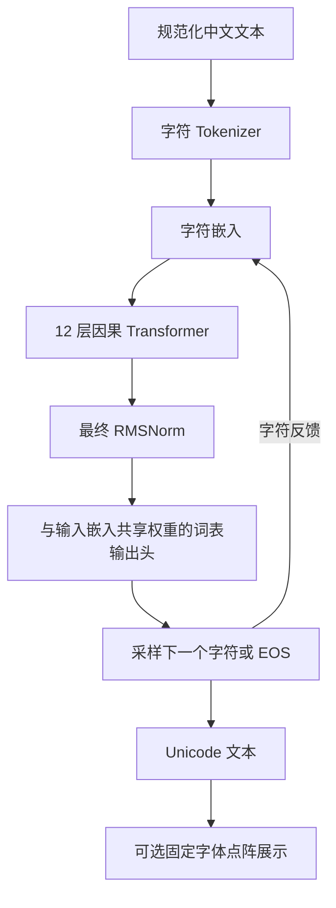
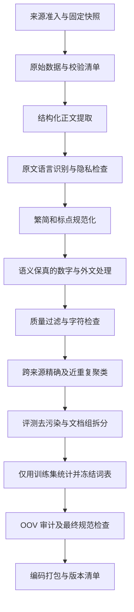

# HansGPT：纯中文字符语言模型与数据方案

日期：2026-09-07。状态：设计提案，尚未实现新模型、下载新语料或启动训练。

## 1. 推荐决策与研究边界

第一版采用 **从零训练、一字一 Token、约 88M 参数的稠密 Decoder-only Transformer**。先建立可连续生成中文的 HansGPT-Char 基线，再通过受控实验加入字形或部件表示。

本文暂按以下需求设计，后续可根据使用目标调整：

- 内容字符允许汉字、明确列举的中文标点和换行；不保留拉丁字母、阿拉伯数字、代码、表情。
- 以现代简体中文为主，数字在能可靠解释语义时转换为中文数字。
- 模型预测下一个字符 ID，正常输出 Unicode 中文文本；点阵是可选的表示和展示能力。
- 沿用已有实验记录中的训练服务器 RTX 5060 Ti 16GB 作为起步硬件，实际吞吐和显存必须重新实测。

原来的 [研究方案](RESEARCH_PLAN.md) 研究冻结预训练模型中的字形可解码性。新方案训练嵌入、骨干和输出层，是另一条实验路线。原有冻结骨干、单线性输出头和字符不重叠评测仍适用于原探针实验，不能用它们约束新语言模型的全部训练。

[诊断报告](GLYPH_BOTTLENECK_DIAGNOSTIC_REPORT.md) 中，已见字的 MLP 重建很强，但未见字身份检索很弱。这支持引入可检验的结构先验；它不证明所有原子字符语言模型必然缺乏字形泛化能力，也不证明字形增强一定改善语言能力。

三种“纯”的含义需要分别记录：

| 层面 | 本方案如何满足 | 能说明什么 |
|---|---|---|
| 输出字符纯度 | 内容词表白名单，屏蔽保留位和非内容特殊符号 | 输出不会出现词表外字符 |
| 训练语料纯度 | 原文语言识别、中文清洗、最终字符校验和人工抽检 | 对语料语言和字符组成提供证据 |
| 预训练来源纯度 | 所有语言模型参数随机初始化，只用本项目中文训练集 | 不继承已有多语言骨干的训练历史 |

只有汉字并不等于一定是中文，日文也使用汉字。字符约束不能替代语言识别。只裁剪 Qwen 的词表并继续训练，可以得到中文输出受限的模型，但不能称为仅以中文从零预训练的模型。

## 2. 词表与 Tokenizer

### 2.1 字符级编码

第一版不用 BPE、英文子词或字节回退。一个 Unicode 汉字对应一个 Token，一个允许的标点或换行也对应一个 Token。例如：

```text
输入：春风吹过山林。
编码：[春] [风] [吹] [过] [山] [林] [。]
训练：根据前缀预测下一个字符，最后预测 EOS
```

这样能直接对齐字形、字频和预测目标，也减少汉字被拆成多个字节片段的问题。代价是常见多字词不再合并，长文可能需要更多 Token；相同文本的长度、吞吐和质量都要实测。小词表节省嵌入和分类头参数，不代表总体训练一定更快。

### 2.2 词表构建

建议模型容量先设为 `vocab_size=16384`，实际可用字符数由审计确定，不为凑齐容量加入噪声字符。

1. 以官方《通用规范汉字表》的 8,105 字建立核心集合。
2. 在完成来源分组和训练集拆分之后，只从训练文本统计补充字频，加入真实出现的姓名、地名和领域用字。
3. 用固定版本 Unicode/Unihan 校验码点和元数据；候选识别使用 `Unified_Ideograph` 等正式属性，并显式处理 `〇`，不能只匹配 `\u4e00-\u9fff`。
4. v1 采用固定版本 OpenCC `t2s` 配置，保留原文和转换记录。简繁转换并非完全无损，专名和歧义映射要抽检。繁体原样生成可作为后续独立版本。
5. 标点采用显式清单，例如 `，。！？；：、（）《》〈〉“”‘’「」『』【】〔〕…—·`，加换行；清单需包含清洗器可能产生的全部符号。
6. 预留少量特殊 ID：`PAD`、`BOS`、`EOS`、`UNK`，以及后续对话角色和回合结束 ID。它们是协议控制，不是输出正文中的英文字符串。
7. 内容字符按固定规则排序并写入 `vocab.json`；保存字符类别、码点、来源、频次、词表版本和 SHA-256。发布后不得重排 ID。

可以对齐到 16,384 行存储，未使用行必须在训练分类和生成时一致屏蔽；生成时只放行内容字符和当前协议允许的终止 ID。用户原文中的特殊符号名称不能被直接解释为控制 ID，角色由结构化接口传入。

词表和嵌入版本绑定。容量不足时发布新词表版本，并显式迁移旧权重和 ID；不能在训练中静默增加字符。

收录某个字只保证它可表示，不保证模型已学会使用它。需单列训练频次为零或极低的词表项，不能把字表覆盖当成语言能力覆盖。

### 2.3 生僻字与输入契约

- 训练文本出现词表外字符时，隔离相应句段并统计原因；不以 `UNK` 替换后混入训练。
- 对用户输入，先执行已定义的文本规范化；仍有词表外字符则返回具体位置和码点，让调用方明确处理，不能静默吞字。
- `UNK` 仅为工具兼容或错误诊断保留，不作为正常训练目标或可生成内容。
- `decode(encode(canonical_text)) == canonical_text` 必须成立；原始文本的繁简、数字等转换另外记录，不宣称原文无损往返。
- 实现按 Unicode 码点迭代，尤其 JavaScript 不能把扩展区汉字的 UTF-16 代理对拆开。

覆盖率按全部候选文本计算，不能先删除词表外句子再报告“百分之百覆盖”。同时报告字符覆盖率、受影响句段比例、专名和各领域覆盖率。训练字符覆盖率 99.99% 可作为初始目标，最终阈值需要样本审计确定。

字体覆盖不能决定语言词表：真实中文字符缺少当前字体字形时，语言分支仍可保留，字形分支使用缺失掩码。

有限字符词表不能输出未收录字符。后续若必须覆盖更大范围，可扩大字表，或单独研究“已知字用单 Token，未知字用 IDS 构件序列”的编码。后者有序列膨胀、分解歧义、布局和回译问题，不纳入 v1。

如果要求连标点都不能有，应另建严格汉字语料和模型配置，只保留不可见文档结束控制。直接删除标点会损失断句、引用和语气信息；不能把两种训练结果混为同一实验。

## 3. 模型架构

### 3.1 HansGPT-Char 基线



每层采用：

```text
x = x + GQA(RMSNorm(x), RoPE, causal_mask)
x = x + SwiGLU(RMSNorm(x))
```

| 配置 | Tiny | Base，推荐首个正式基线 | Medium，后续扩展 |
|---|---:|---:|---:|
| 层数 | 8 | 12 | 24 |
| 隐藏维度 | 512 | 768 | 1024 |
| Query 头数 | 8 | 12 | 16 |
| KV 头数 | 2 | 4 | 4 |
| 每头维度 | 64 | 64 | 64 |
| FFN 中间维度 | 1408 | 2048 | 2816 |
| 词表容量 | 16384 | 16384 | 16384 |
| 约参数量 | 30.94M | 88.10M | 287.36M |
| 初始训练长度 | 512 | 1024 | 1024 |
| 验证后扩展长度 | 1024 | 2048 | 2048～4096 |

参数估算包含共享嵌入和 RMSNorm，不含字形分支，线性层不使用 bias。Base 的共享嵌入约 12.58M 参数。训练前由实际模型构造程序再次核对参数量。

建议直接使用项目已有 Transformers 的 `LlamaConfig` / `LlamaForCausalLM` 构造随机模型，配置 GQA、SwiGLU、RMSNorm、RoPE 和 `tie_word_embeddings=True`，复用成熟的损失、生成、KV cache 和保存机制。首次使用需验证当前锁定版本的实现和权重共享。不要从预训练权重初始化这条基线。

主目标为标准因果交叉熵：

```text
L_lm = -mean(log p(x[t+1] | x[0:t]))
```

训练前向只接收前缀位置的输入；标签右移一次，防止框架内外重复右移。PAD 和无效标签不参与损失。普通语言模型按文档泛化，同一个汉字正常出现在训练和测试文本中。

字形展示使用“预测字符 → 固定字体渲染”，可以保证展示的字符身份。它不属于神经网络学会画字的证据。模型的主要输出头始终负责预测字符，避免先产生模糊点阵、再错误检索并反馈造成连锁误差。

### 3.2 HansGPT-Shape 可选增强

在 Base 基线成立后，一次只加入一种表示，保持相同文本、拆分和训练预算：

```text
e(c) = E_char[c] + alpha * P_g(glyph_encoder(bitmap(c)))
```

或独立测试：

```text
e(c) = E_char[c] + beta * P_s(structure_encoder(IDS_tree(c)))
```

- 字形来自固定字体和渲染配置，可复用当前 32×32 字形管线；复杂字的分辨率限制另做 64×64 消融。
- 结构编码必须保留左右、上下、包围等布局和部件顺序。简单平均部首向量不能表示空间组合。
- 非汉字或缺失元数据使用零增量和显式掩码，不把未知字形当成相同的缺字方框。
- 首轮可冻结字形编码器并缓存特征，训练投影和语言模型；缓存须绑定编码器、字体和渲染版本。若解冻编码器，缓存必须随权重更新，不能继续用旧特征。
- 从较小的可学习门控系数开始，让语言损失决定增强信号的权重；首先检查同预算验证损失和低频字能力是否改善。
- 输出头仍共享 `E_char` 的权重，结构增量只作用于输入，便于对照；后续才测试结构化输出表示。

若增加下一字字形辅助头，必须从 `h[t]` 预测 `bitmap(x[t+1])`；下一字的图像和 IDS 只能作为标签，不能进入该位置输入。候选权重为 `L_lm + lambda * L_glyph`，先比较 `lambda=0` 与小权重，再按验证集选择。一个前缀存在多个合理续字时，像素损失容易产生平均字形，因此它不能替代字符交叉熵。

自字符重建是另一项任务，输入中已提供该字字形时重建成功不能证明推理或未见字泛化。结构资料覆盖测试字也属于额外信息，必须声明。若要复现严格的未见字形实验，辅助编码器和字形监督也要遵守相应字符或构件拆分。

### 3.3 其他路线的定位

| 路线 | 适用目标 | 必须承担的成本 |
|---|---|---|
| 从零训练字符 GPT | 研究词表、中文数据和结构表示的真实贡献 | 需要完整预训练，早期能力有限 |
| 改造现有模型词表并继续预训练 | 更快获得可用中文生成能力 | 继承原训练历史；词表和序列分布迁移仍需训练 |
| IDS 或笔画自回归 | 研究构件组合和超出固定字表的表示 | 更长序列、合法结构约束、回译和生成闭环 |
| 点阵自回归反馈 | 把字形生成作为核心研究对象 | 需图像输入编码器、可微/离散反馈与长期误差评测 |

如果采用现有模型迁移，对恰好单 Token 的汉字可复制对应嵌入和输出行，多 Token 汉字需要单独初始化或对齐学习。均值初始化只是一种启发式，不保持原模型等价；短暂适配新嵌入后通常还需继续训练骨干，不能仅换输出头即完成迁移。

## 4. 数据来源与采集策略

### 4.1 候选来源

以下为 2026-09-07 核对的官方入口。除已确认的页面和元数据外，不把可用量或清洗后规模当成已验证事实。

| 来源 | 主要用途 | 采集与使用边界 |
|---|---|---|
| [中文维基百科](https://dumps.wikimedia.org/zhwiki/) | 百科、说明文、知识性叙述 | 固定日期的正文 XML dump；记录页面和修订；保留归属及适用许可 |
| [中文维基文库](https://dumps.wikimedia.org/zhwikisource/) | 合适的公版作品、历史材料、长篇结构 | 逐作品确认原作、翻译和版本权利；不能把全部作品当公版 |
| [中文维基教科书](https://dumps.wikimedia.org/zhwikibooks/) | 中文教程和解释性文本补充 | 量级以实际抽样为准；保留来源和许可 |
| [FineWeb2](https://huggingface.co/datasets/HuggingFaceFW/fineweb-2)，`cmn_Hani` | 扩展现代中文网页覆盖 | 固定 revision，选择中文分片；重新执行本项目清洗、语言识别、隐私过滤和去重 |
| 自有或明确授权的中文书籍、问答、说明书 | 弥补口语、长文和专业领域缺口 | 保存授权范围、版本、文档来源和再分发条件 |

FineWeb2 官方卡片确认普通话中文分区为 `cmn_Hani`，不是 `zh` 或未经核实的 `cmn_Hans`。其数据集许可为 ODC-By 1.0，同时受 [Common Crawl 使用条款](https://commoncrawl.org/terms-of-use) 约束；这不等于原网页内容的著作权全部开放。按来源和用途建立可用清单，无法满足项目使用条件的材料进入隔离区。

官方卡片也明确指出中文上存在表现更好的其他语料，并披露其电话隐私过滤等局限。因此选它作为可复现候选池，不预设它是质量最好的中文训练集，也不认为上游清洗已经解决中文纯度和隐私问题。

首轮优先使用有清晰使用依据的材料。百度百科、付费书库、未经授权的社区问答不能因能访问就自动纳入。现有中文维基规模适合验证管线，能否支撑目标训练量须实际统计，不能靠重复它来填满规模指标。

### 4.2 直接下载到训练服务器

先本地提交并推送代码，再由 `/root/HansGPT` 拉取和 `uv sync --frozen`。本机只读取资料页面和开发代码，不下载语料、模型或创建研究环境。

服务器采集规则：

1. 每个来源先读取清单，记录日期、revision、官方 URL、许可、大小和可用校验值。
2. 先选取约 1,000～10,000 篇用于解析烟测，再分来源抽样，累计约 1,000 万～5,000 万字符用于清洗审计。
3. HTTP 采用重试、退避和支持时的 Range 续传；保留分片状态。校验官方校验和，并另算 SHA-256。
4. Wikimedia 选择已完成的日期快照，检查 `dumpstatus.json`，不把滚动 `latest` 作为实验标识。核对时 `20260901` 的中文维基正文任务状态为 `done`，实际运行前再次检查。
5. FineWeb2 按固定 revision 的文件清单，在不同 crawl 日期和分片间确定性抽样；不要只取流的前若干条，也不要整库下载。
6. 增量采集按来源 ID、修订和原始哈希跳过已处理材料；官方源失败时记录失败，不自动换镜像。

自己抓取网页仅在候选池不足时增加：优先站点官方数据接口、dump、sitemap 或允许的批量入口，遵守站点使用条件、抓取频率和 robots 规则；不绕过访问控制。HTTP 状态、编码、时间和正文提取结果须可追溯。

### 4.3 配比与规模

起始配比按**清洗后实际采样 Token 数**定义，属于目标而非已取得的资源：

| 内容类型 | 初始占比 |
|---|---:|
| 通过审计的现代中文网页 | 40% |
| 百科、科普和解释性内容 | 25% |
| 有使用依据的现代长文、书籍 | 20% |
| 有使用依据的问答和对话 | 10% |
| 古文、诗词等专项材料 | 5% |

同一文档只分配一个主类别，避免重复计数。对话和书籍不足时公布缺口并调整配比，不能用未审核来源或大规模自动生成文本补数。对单站点、作者和作品设置采样上限，限制低质量大站或单部长篇支配训练。

建议 Tiny 先训练 1 亿～3 亿 Token；Base 正式试验目标约 15 亿～30 亿 Token；Medium 暂按约 60 亿～100 亿 Token 规划，先确认数据和算力。以上为起步预算，不是“每参数固定多少字符即可训练好”的定律，字符 Token 与其他模型的 BPE Token 不能直接类比。

分别报告去重后的独立内容量、实际训练呈现量和每来源重复次数。不足时缩小模型或减少预算。20 亿 Token 以 uint16 保存的裸 ID 约 4 GB，原始网页、文本、去重索引和中间表所需空间另算，不能据此估计全管线磁盘。

## 5. 清洗流水线



### 5.1 正文提取与语言识别

- XML 使用流式解析器，维基语法使用成熟解析器。只保留适用命名空间的正文；去掉导航、模板、编辑说明、引用标记和无文本表格，保留标题层级和段落边界。
- HTML 使用正文提取库，如 Trafilatura；不能用一条正则去除 HTML 后直接当训练文本。已有提取文本的来源避免二次假装解析 HTML。
- 识别文档、段落的主要语言，并记录中文、日文、韩文和其他语言分数。使用固定版本语言识别器，中文概率阈值先以 0.9 做候选，再用分来源人工标注校准。
- 原文先识别语言，再处理字符，防止删除假名或外文后把外语误判为中文。短句、诗词、古文和专名需要单独抽检规则。
- 在号码和外文规范化前识别邮箱、手机号、身份号码、带个人关联的地址等信息；高置信隐私句段隔离。普通年份、公开地名、人名不能一刀切删除。

### 5.2 规范化与语义保真

保留原文哈希和规范化版本。使用固定 Unicode 版本的 NFC，以及显式标点、宽度、空白映射；NFC 也可能影响部分兼容表意文字，应记录变化。避免对整段不加区分地使用 NFKC。

换行统一，连续空白和页面缩进规范化，保留段落边界；连字符、负号、小数点等先按上下文分类，再决定转换，不能提前全部当标点替换。OpenCC 转换应早于最终词表检查。

数字处理使用可测试的有限语法和成熟数字转换工具，先识别类型，无法判定时隔离：

| 原文片段 | 可接受的处理示例 | 处理条件 |
|---|---|---|
| `2026年` | `二〇二六年` | 明确为年份 |
| `12个人` | `十二个人` | 明确为计数 |
| `3.14` | `三点一四` | 明确为小数 |
| `12%` | `百分之十二` | 明确为百分数 |
| `2026-09-07` | `二〇二六年九月七日` | 已验证为合法日期 |
| `-5℃` | `零下五摄氏度` | 明确为温度 |
| `3/4` | 不直接转换 | 可能是分数、日期或编号 |
| `5G`、`C++`、化学式、型号 | 经审核术语映射或隔离句段 | 不能只删数字和字母 |

不把编号、电话、小数、序号、日期统一逐位改写。不得把不明表达交给模型随意改写后当作原始事实。

外文缩写只有在上下文和词典确认时才替换为中文名称，例如某一上下文中的 `AI` 可映射为“人工智能”。保留规则 ID 和替换记录。词义不确定的句子隔离；独立的英文导航或引用段可以整段去掉。删除段落后保留分隔，不能跨缺口拼成一个句子。

例如 `这个模型支持Python和中文。` 不能简单变成 `这个模型支持和中文。`。若没有经过审核的完整中文表达，则不进入 v1 主训练集。严格字符限制会减少数学、编程、国际专名等领域覆盖，需在数据卡中量化这种损失。

### 5.3 质量和最终字符检查

质量阈值先用于试运行，抽检后固化：

- 现代正文可先以不少于约 50 个汉字、汉字占非空白字符至少约 80% 为候选；短问答、诗词等采用独立规则，不能由通用长度过滤全部删除。
- 检查乱码、替换字符、控制字符、重复导航、关键词堆砌、广告、句段重复、异常标点和异常字符熵。
- 连续相同字符超过约 10 次、重复行比例超过约 30% 等信号进入复核或降权；诗歌、列表等需结合类型判断。
- 不用英文停用词、空格词数或英文词长阈值判断中文。中文近重复和统计使用字符或经过验证的中文切分。
- 最终正文必须百分之百属于规范允许集合；冻结词表后再保证每个字符都可编码。比例筛选合格不等于最终字符合格。
- 每个处理阶段输出接受数、拒绝数、字符量、原因码、按来源/领域的分布变化和少量可审计样例。

如加入模型质量评分，它只作为经校准的排序信号，不能把“像百科”当成通用质量标准，也不能用最终测试集训练或调节评分器。v1 主语料不依赖大模型批量重写。

### 5.4 去重与防泄漏

1. 原文和规范化正文分别计算 SHA-256，识别原始副本和清洗后相同文档。
2. 使用段落哈希去除模板和复用片段，并限制长篇作品或镜像的重复贡献。
3. 用中文字符 5-gram 的 MinHash/LSH 建立近重复候选，Jaccard 约 0.8 作为初始复核阈值；短文本使用适配规则，避免依赖过少 shingle。
4. 原始与简体规范化视图共同参与聚类，以发现简繁、镜像、转载和格式版本。对聚类中的相邻版本进行质量择优，同时保存全部来源关系。
5. 预先冻结评测题、参考答案和自建测试材料，按精确片段和模糊匹配去除训练重叠；短通用表述不能单凭小片段匹配就删整篇。
6. 按作品、来源文档族和重复簇拆分，例如训练/验证/测试为 98%/1%/1%。同一本书各章节、同一文章各版本和镜像必须同组；比例按组分层并报告实际 Token 比例。
7. 另留整个站点或较晚时间段作为域外集，并清除其与训练集的重复。所有拆分在切块和随机混合之前完成。

固定拆分种子和 manifest，拆分后再次做跨集合近重复审计。验证集用于规则和模型选择；最终测试结果只用于报告。如果测试集出现词表外字符，报告覆盖率及明确分母，不能不说明地删去后宣称全量评测。

语言建模的主拆分是文档或作品不重叠，而非字符不重叠。把一个汉字从所有语言训练中排除，评测的是零样本词汇问题，不是普通中文生成能力。原来的字符和构件拆分继续单独用于字形研究。

## 6. 数据存储与训练输入

建议服务器目录如下，均遵守现有 Git 忽略规则：

```text
/root/HansGPT/data/raw/hansgpt/          原始分片、下载清单
/root/HansGPT/data/interim/hansgpt/      解析、隔离、规范化、去重中间表
/root/HansGPT/data/processed/hansgpt/    文本、词表引用、拆分、Token 分片
/root/HansGPT/artifacts/logs/           下载、清洗和训练日志
/root/HansGPT/artifacts/checkpoints/    模型、优化器和续训状态
/root/HansGPT/artifacts/reports/        数据卡、质量报告和评测
```

文档级 Parquet 至少包含：

```text
doc_id, source_id, source_doc_id, source_revision, source_url,
license_id, rights_status, acquired_at, raw_sha256, text_sha256,
text, language_scores, script_variant, domain,
normalization_version, transform_counts, quality_scores,
rejection_reasons, dedup_cluster_id, work_id, split,
char_count, oov_count, tokenizer_sha256
```

采集清单与规范化变更记录允许单独分表引用；训练只读取正文和结构控制，不能把 URL、许可字段等英文元数据拼进模型输入。私有授权材料的标识和审核样例也不能直接写入公开仓库。

Token 数据可采用 uint16 分片加文档 offset 索引，并保存每个分片的 SHA-256；容量超过 65,536 时明确切换存储类型。代码、配置、公开的小型 manifest 示例入 Git，实际语料、特征、字体、模型和大索引不提交。

训练打包不能把独立文章当作自然连续文本。第一版可按文档分块并 padding；后续使用经过验证的文档边界隔离 attention，文档间不能互相注意，跨文档预测标签也必须屏蔽。仅插入 EOS 不会自动隔离 attention。

若底层高效 attention 内核不支持所需分段掩码，就继续用文档内分块，不能静默回退到跨文档混读。记录长文截断率和有效非 padding Token 比例。相邻长文块可携带固定前缀上下文，但重叠位置的损失不重复计数。

## 7. 训练、算力与推进顺序

### 7.1 建议初始配置

- 全部语言模型参数参与训练。先用 PyTorch SDPA，BF16 autocast；参数、梯度和 AdamW 状态精度按实测稳定性明确记录。
- AdamW 起始候选：学习率 `3e-4`、`betas=(0.9, 0.95)`、`weight_decay=0.1`、梯度裁剪 `1.0`；norm/bias 等不衰减参数分组显式配置。
- 约 1%～3% 训练 Token 用于 warmup，随后 cosine decay 至峰值的约 10%；这些是待验证起点，不能当作通用最优值。
- Base 从长度 1024、micro-batch 1～2 开始，按有效目标 Token 数做梯度累积，有效批量先试约 32K Token。混合长度时按有效标签数归一化损失。
- 需要时启用 activation checkpointing，训练 `use_cache=False`；训练稳定后再试长度 2048，重新测吞吐和显存。
- 不一开始引入 MoE、长上下文、量化训练或多种结构分支，以便识别数据和训练实现的影响。

按 FP32 参数、梯度和两个 AdamW 动量粗算，状态约为每参数 16 字节：88M 约 1.31 GiB，287M 约 4.28 GiB。以上不包含激活、logits、临时张量、缓存和分配器空间，也不包含可能的额外权重副本；**不能把参数存得下等同于训练一定可行**。

记录端到端非 padding Token/s，再估算总时间。举例，20 亿 Token 在 1,000、3,000、10,000 Token/s 下分别约需 23.1、7.7、2.3 天，仅用于换算，未声称该显卡达到任一吞吐，且未计入评测、保存和中断。

单卡 16GB 适合先验证 Tiny/Base。Medium 是否值得训练取决于实测显存、时间和独立语料量。多十亿参数从零预训练不作为当前第一步。

### 7.2 阶段门槛

| 阶段 | 工作 | 进入下一阶段的条件 |
|---|---|---|
| A：数据审计 | 小规模采集、清洗、词表草案；每个主要来源人工抽检至少约 200 条 | 统计字符覆盖、许可/来源、清洗损伤和领域损失；严重语义损坏修复 |
| B：最小训练 | Tiny 在少量样本上过拟合检查，再训练约 500 万～1,000 万 Token 烟测 | 标签右移、掩码、词表约束、保存续训正确；loss 有效下降 |
| C：基线验证 | Tiny 约 1 亿～3 亿 Token，比较来源配比和清洗版本 | 固定验证集上有改善，生成无系统性乱码、循环或边界错误 |
| D：正式 Base | 88M 在冻结版本语料上训练约 15 亿～30 亿 Token | 数据量和实测时间可接受，完整记录评测和覆盖率 |
| E：结构消融 | 同预算比较字符基线、字形增强、IDS 增强 | 语言质量或低频字指标稳定改善；字形泛化另有证据 |
| F：中文助手 | 单独进行纯中文指令微调 | 训练/测试任务去重，人工评审回答正确性和指令遵循 |

预训练得到的是续写模型，不自动成为聊天助手。指令微调的数据也必须走同一字符、来源和清洗规则；使用结构化角色 ID，通常只在助手回答上计算损失。先规划约 1 万～5 万条审核样本验证流程，再按收益扩大，不默认已有足量合适数据。

长任务在确认服务器 `tmux` 等会话管理器存在后运行。启动前按 AGENTS.md 检查工作区、拉取已提交代码、`uv sync --frozen` 和环境检查；服务器有未提交源代码变化时先检查，不覆盖。每次训练保存 Git 提交、数据和词表哈希、配置、随机种子、软件版本、GPU、精度、采样器及优化器状态。

## 8. 评测与验收

| 维度 | 指标或检查 |
|---|---|
| 编码契约 | 规范文本往返一致率 100%；训练正常目标无 UNK；保留位不可生成；扩展区码点正确 |
| 数据质量 | 清洗保留率、语义损坏抽检率、语言误判率、OOV 率、各来源和领域配比 |
| 数据泄漏 | 跨拆分精确重复为零；近重复和评测污染审计；作品与镜像隔离 |
| 语言建模 | 全内容字符 NLL、单独汉字 NLL、分领域 NLL、同词表困惑度 |
| 文本生成 | 流畅度、事实一致性、重复率、长程一致性、标点和终止行为，进行固定提示盲评 |
| 中文能力 | 阅读理解、完形填空、纠错、摘要和长文续写；保留任务覆盖及人工检查 |
| 稀有字 | 按训练字频分桶的预测损失与检索/选择任务，单列姓名和地名 |
| 资源 | 有效 Token/s、峰值显存、训练 Token 总量、墙钟时间和数据重复次数 |
| 字形支线 | 前景 F1、IoU、Dice、完整点阵匹配、最近字形检索及构件拆分结果 |

跨不同 tokenizer 的模型不能直接比较 per-token perplexity。对同一份可规范化中文文本累加 log probability，再按相同正文码点数报告 bits per character，并统一 BOS/EOS 的计分约定；同时按相同训练算力或文本量分别比较效率。不同约束导致无法表示的文本必须另报覆盖率。

可以参考 C-Eval、CMMLU 等中文任务，但含英文、公式或字母选项的题目不能粗暴删改。筛选可表达子集，记录剔除比例；若把选项转成“甲乙丙丁”或转换数字，须标为改编协议，不与原版总分直接横比。

主要对照为相同字符基线的数据清洗版本，以及同预算的字形/IDS 增强版本。字符 unigram/n-gram 可作为烟测下限；现有 Qwen 仅作为外部能力参考，不能把其更大的参数量和不同训练历史当成结构增强的公平对照。结构收益优先在小模型上做多个种子验证，再扩大规模。

## 9. 工程落地范围

建议新增独立包或模块边界，保留现有探针代码：

```text
src/hansgpt_lm/tokenization/     字表、字符编码、输入校验
src/hansgpt_lm/data/             来源适配、规范化、过滤、去重、拆分、打包
src/hansgpt_lm/models/           标准随机模型构造、可选字形/IDS 输入
src/hansgpt_lm/training/         训练配置、采样、恢复、记录
src/hansgpt_lm/evaluation/       字符计分、生成评测、泄漏和覆盖报告
configs/hansgpt/                 版本化模型、数据和运行配置
```

这些是待实现路径，不代表当前仓库已有对应命令。实现时优先沿用现有 PyTorch、Transformers、PyArrow、OpenCC、Unicode 和字形工具；按需增加正文提取和去重库，更新 `pyproject.toml` 后使用 `uv lock`。

最先交付的实际模块应是词表构建、语义保真清洗、数据版本报告和 Tiny 训练闭环。必要测试覆盖数字歧义、外文断句、扩展区汉字、字表往返、作品拆分、跨文档 attention/标签隔离、因果标签对齐以及断点续训；Python/GPU 集成测试在服务器运行。

## 10. 依据与尚需核实的事项

- 字表依据：[国务院公布《通用规范汉字表》](https://www.gov.cn/zwgk/2013-08/19/content_2469793.htm)。正式构建时核对附件内容、解析结果和字数。
- Unicode：[UAX #38 / Unihan](https://www.unicode.org/reports/tr38/)。固定实际使用的 Unicode release，不依赖随时间变化的 latest 内容。
- 字形：[Noto CJK](https://github.com/notofonts/noto-cjk) 及项目已固定字体；沿用已有文件校验和并检查目标字符覆盖。
- 结构：[CHISE IDS](https://github.com/chise/ids)。本次未完成逐文件许可复核；正式启用结构分支前固定 revision 并审查所用文件许可，不能直接假设与字体或语言数据同许可。
- 网页候选：[FineWeb2 数据卡](https://huggingface.co/datasets/HuggingFaceFW/fineweb-2) 和 [Common Crawl 条款](https://commoncrawl.org/terms-of-use)。已核对中文分区、数据集许可和上游局限；未下载正文或完成本项目质量审计。
- Wikimedia：[使用条款](https://foundation.wikimedia.org/wiki/Policy:Terms_of_Use) 与各作品的具体权利信息；语料版本、归属和发布条件须随 manifest 保存。
- 尚未实测：当前服务器训练吞吐、Base 的实际峰值显存、各来源清洗保留率、16K 词表覆盖率和结构增强收益。以上都由阶段 A～E 的结果决定，不能提前当作成功结论。
