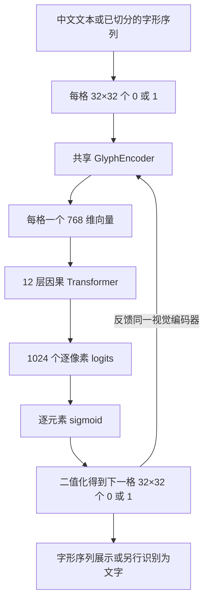
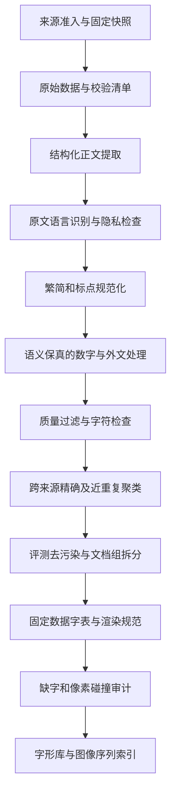

# 原生二值字形生成模型 v1 与 v2 (Binary Glyph Language Models)

本专题整合了抛弃 Unicode/BPE、以 32×32 二值像素图作为直接输入与预测目标的端到端生成模型设计方案（v1 像素 BCE、v2 混合伯努利头/条件 GAN）及生成问题诊断。

---

## 目录

1. [第一部分：原生二值字形模型与数据设计方案提案](#第一部分原生二值字形模型与数据设计方案提案)
2. [第二部分：二值字形 GPT v1 训练协议与全量评测报告](#第二部分二值字形-gpt-v1-训练协议与全量评测报告)
3. [第三部分：二值字形生成退化分析与改进研究](#第三部分二值字形生成退化分析与改进研究)
4. [第四部分：二值字形 GPT v2 混合头与条件对抗微调协议](#第四部分二值字形-gpt-v2-混合头与条件对抗微调协议)

---

## 第一部分：原生二值字形模型与数据设计方案提案
> 原文档来源：`HANSGPT_MODEL_AND_DATA_DESIGN.md`

# HansGPT：32×32 二值字形输入与预测的语言模型方案

日期：2026-09-07。状态：设计与实施方案，数据、模型、训练和评估管线已加入仓库；实际实验是否完成以运行记录和结果报告为准。固定运行协议见 [BINARY_GPT_EXPERIMENT.md](BINARY_GPT_EXPERIMENT.md)。

## 1. 推荐决策与研究边界

已确定的主架构是 **32×32 二值格子 → 共享视觉编码器 → 字形 embedding → 因果 Transformer → 下一张 32×32 二值格子**。每个格子占一个语言序列位置，输入和预测目标都是 1024 个二值像素。生成的二值格子重新通过同一个视觉编码器，形成连续预测闭环。

已经确定的输入与输出契约：

- 模型接收 `glyphs: [batch, sequence, 1, 32, 32]`，每个像素只取 0 或 1，背景为 0、笔画为 1。
- 同一个视觉编码器处理所有格子，产生 `[batch, sequence, hidden_size]`，再交给从零训练的语言骨干。
- 字符 ID、码点、读音、部首、IDS 和字符类别都不能成为主模型的输入特征。文件索引与评测元数据可以存在，但不能绕过像素直接产生输入 embedding。
- 一字一格、一格一个外层 Token。格子内部的卷积位置不计入语言模型的上下文长度。
- 每个序列位置预测下一格的 1024 个二值，训练标签为 `targets: [batch, sequence, 1, 32, 32]`，标签元素只能是 0 或 1。
- 首版一次输出每格的 1024 个浮点 logits，分别表示对应像素为 1 的倾向。训练使用可微的二元损失；实际展示和反馈前必须得到严格的 0/1 格子。浮点 logits 和 sigmoid 概率不属于最终图像格式。
- 主模型没有字符分类输出头、字符 softmax 或灰度图目标；Unicode 与字符身份仅用于语料制作和评测。

继续沿用的数据假设：

- 内容字符允许汉字、明确列举的中文标点和换行；不保留拉丁字母、阿拉伯数字、代码、表情。
- 以现代简体中文为主，数字在能可靠解释语义时转换为中文数字。
- 沿用已有实验记录中的训练服务器 RTX 5060 Ti 16GB 作为起步硬件，实际吞吐和显存必须重新实测。

下一步预测的单位是一整张 32×32 二值格子，而不是一个 Unicode 类别或某个单独像素的外层 Token。第 3 节定义逐像素二元预测、损失和生成反馈，不再保留输出形式待选项。

原来的 [研究方案](RESEARCH_PLAN.md) 研究冻结预训练模型中的字形可解码性。新方案训练视觉编码器、骨干和输出层，是另一条实验路线。原有冻结骨干、单线性输出头和字符不重叠评测仍适用于原探针实验，不能用它们约束新语言模型的全部训练。

[诊断报告](GLYPH_BOTTLENECK_DIAGNOSTIC_REPORT.md) 中，已见字的 MLP 重建很强，但未见字身份检索很弱。直接输入字形能向模型提供真实笔画和布局信息，不过字形相似不等于语义相似，仍需通过中文上下文学习语义。不能由输入形式直接推断未见字理解能力。

以下边界需要分别记录：

| 层面 | 本方案如何满足 | 能说明什么 |
|---|---|---|
| 输入形式 | 所有正文格子通过共享视觉编码器 | 输入表示只由像素决定 |
| 输出约束 | 每步生成 32×32 个 0/1，二值化后反馈 | 格式严格二值；是否为合法汉字另行评测 |
| 训练语料纯度 | 原文语言识别、中文清洗、最终字符校验和人工抽检 | 对语料语言和字符组成提供证据 |
| 预训练来源纯度 | 所有语言模型参数随机初始化，只用本项目中文训练集 | 不继承已有多语言骨干的训练历史 |

只有汉字并不等于一定是中文，日文也使用汉字。字符约束不能替代语言识别。只裁剪 Qwen 的词表并继续训练，可以得到中文输出受限的模型，但不能称为仅以中文从零预训练的模型。

## 2. 字形格子与数据字表

### 2.1 以格子为单位的编码

文本语料先规范化和按 Unicode 码点切分，再用确定性渲染器形成格子。模型本身直接接收格子，也可接收外部已经切好的 32×32 图像序列。例如：

```text
输入：春风吹过山林。
渲染：[春的图] [风的图] [吹的图] [过的图] [山的图] [林的图] [。的图]
张量：[7, 1, 32, 32]
编码：[e_春] [e_风] [e_吹] [e_过] [e_山] [e_林] [e_。]
向量：每个 e 均由该格子像素通过同一个 CNN 计算
```

这里没有 BPE、OCR 后的字符查表或字节回退，也不把 1024 个像素各自变成一个外层语言 Token。格子内二维位置由 CNN 保留，格子间顺序由 Transformer 的 RoPE 表示。页面截图或连写手稿需要另外的切字模块，不属于当前已切格子输入契约。

### 2.2 字表的职责

保留数据字表，用于语料准入、渲染资产索引、统计、标签和评测。它不是一个可训练的 `Embedding(V, D)`。可从约 8K～16K 个规范字符开始，但视觉编码器的参数量不依赖字符数量。

1. 以官方《通用规范汉字表》的 8,105 字建立核心集合。
2. 在完成来源分组和训练集拆分之后，只从训练文本统计补充字频，加入真实出现的姓名、地名和领域用字。
3. 用固定版本 Unicode/Unihan 校验码点和元数据；候选识别使用 `Unified_Ideograph` 等正式属性，并显式处理 `〇`，不能只匹配 `\u4e00-\u9fff`。
4. v1 采用固定版本 OpenCC `t2s` 配置，保留原文和转换记录。简繁转换并非完全无损，专名和歧义映射要抽检。繁体原样生成可作为后续独立版本。
5. 标点采用显式清单，例如 `，。！？；：、（）《》〈〉“”‘’「」『』【】〔〕…—·`，加换行；清单需包含清洗器可能产生的全部符号。
6. 内容字符按固定规则排序并写入 `character_inventory.json`；保存字符类别、码点、来源、频次和版本。资产索引发布后保持稳定，但不会作为输入特征。
7. 每个条目引用 `glyph_bank` 中的 32×32 图像，并记录字体、渲染版本、像素哈希、缺字和碰撞状态。

输出维度固定为 1024，不随数据字表中的字符数量变化。每一维对应一个像素的二分类，而非一个汉字类别；不存在对这 1024 维做字符 softmax 的操作。

数据字表通过显式新版本扩展，不需要扩大输入编码器或像素输出头的参数矩阵。没有有限字符类别约束，二值图的汉字合法性需要评测。

可接收未见字的图像，不等于已经学会它的读音、词义或上下文用法。需单列训练频次为零或极低的字符，不能把图像可编码当成语言能力覆盖。

### 2.3 渲染、控制格子与输入契约

- 固定字体文件、SHA-256、字号、FreeType/Pillow 版本、画布、基线、阈值和裁剪规则。第一版以 Noto Sans CJK SC Regular 的固定字体二值图为主。
- 当前 `glyph_probe.py` 的 `render_glyph` 按每个字符的笔画边界居中，适合原汉字探针，但新的语言输入应采用固定基线和字框，专门检查逗号、句号、引号等的相对位置；不要直接把旧探针图像当作已验证的语言输入资产。
- 检查裁切笔画、全空图、缺字方框和完全相同的像素哈希。若两个字符在 32×32 上完全相同，在相同上下文下纯像素输入无法区分它们；需要记录歧义，必要时隔离或作为等价类评测，不能添加字符 ID 来掩盖。
- 字体不支持的字符不能在主模型中退回字符 embedding。文本入口报告无法渲染的具体码点，训练句段隔离；外部已提供的有效图像仍能进入编码器，识别和语义正确性另评测。
- `BOS`、换行和对话控制等使用固定、互异、与正文图像不碰撞的 32×32 控制格子，并通过同一个 CNN。`PAD` 可为全零格子，但必须用 attention 和 loss mask 排除，换行不能也用空白格子。
- 控制格子不显示为正文，也不含对应英文名称；由结构化接口构造，用户正文不能直接触发协议控制。mask 和位置索引只控制计算，不携带字符身份。
- 换行、回合结束和文档结束也由同一个像素头预测其预定义二值格子，损失与正文一样按像素计算。生成二值图后再识别协议图案并执行换行或停止；不先分类事件再替换成固定格子。
- 第一版按二值图与控制图案的完全匹配识别协议；未正确生成终止图时以最大生成格数兜底。近似匹配若在后续引入，须验证误终止率并单列协议版本，不静默吸附输出图案。
- 实现按 Unicode 码点切分文本，尤其 JavaScript 不能拆开扩展区汉字的 UTF-16 代理对。图像入口仅要求格子尺寸、极性、范围和序列约定正确。

文本与资产索引的往返可以无损；单凭图像还原 Unicode 则不保证一一对应。报告字体覆盖、缺字率、碰撞率、受影响句段和各领域分布，不能删除失败样本后宣称百分之百可表示。

第一版固定字体以控制变量，后续可单独测试新字体，但最终输入与标签仍为二值。字体渲染过程可以有中间灰度缓冲，入库前按固定阈值变成 0/1。不随机翻转或旋转汉字；平移等增强也必须验证身份和二值范围。保留 32×32 主规格，分辨率造成的不可区分需要报告。

如果要求连标点都不能有，应另建严格汉字语料和模型配置，只保留不可见文档结束控制。直接删除标点会损失断句、引用和语气信息；不能把两种训练结果混为同一实验。

## 3. 模型架构

### 3.1 HansGPT-Glyph 主干



核心数据流：

```text
G: [B, T, 1, 32, 32]
e[t] = GlyphEncoder(G[t])          # 只处理当前位置格子
E: [B, T, 768]
H = CausalTransformer(E)           # h[t] 只依赖 G[:t+1]，含当前位置
Z[t] = reshape(Linear(h[t]), [1, 32, 32])
训练：BCEWithLogitsLoss(Z[t], G[t+1])
生成：G_hat[t+1] = (sigmoid(Z[t]) >= threshold)
```

主模型不包含用于正文的 `E_char[id]`，不先 OCR 为字符再查 embedding。训练监督是下一格的二值图，输入向量从当前格的像素算出，字符身份保留在评测元数据中。

### 3.2 共享视觉编码器

第一版用小型 CNN，保留二维空间位置，不一开始引入大型通用视觉模型：

| 步骤 | 输出形状，每格 | 配置 |
|---|---|---|
| 输入 | `1×32×32` | 背景 0，笔画 1 |
| 卷积一 | `32×32×32` | kernel 3，stride 1，padding 1 |
| 卷积二 | `64×16×16` | kernel 3，stride 2，padding 1 |
| 卷积三 | `128×8×8` | kernel 3，stride 2，padding 1 |
| 卷积四 | `128×4×4` | kernel 3，stride 2，padding 1 |
| 展平 | `2048` | 保留各空间位置，避免全局平均丢失布局 |
| 投影 | `768` | `Linear(2048, 768)` |
| 归一化 | `768` | RMSNorm |

每层卷积后使用按单个格子统计的 GroupNorm，8 组，以及 SiLU；卷积与投影不带 bias。该 Base 编码器约 1.81M 参数，是可训练的起步配置，需验证细笔画和相似字可分性。

编码器对 `B*T` 个格子独立执行，禁止沿序列进行非因果混合。尤其不能使用跨格子统计的 BatchNorm：训练时它可能把未来格子的信息带入前缀，且与逐格生成时的统计不一致。句子长度、未来字符或整段图像不能进入当前格子的归一化。

编码器与 Transformer 默认联合训练。字形自编码器预热是可选初始化，不替代语言训练；若使用预热，明确其字符、字体和监督范围。主实验不加入读音、IDS 或独立字符向量输入。

### 3.3 因果语言骨干与规模

每层采用：

```text
x = x + GQA(RMSNorm(x), RoPE, causal_mask)
x = x + SwiGLU(RMSNorm(x))
```

| 配置 | Tiny | Base，推荐首个正式实验 | Medium，后续扩展 |
|---|---:|---:|---:|
| 层数 | 8 | 12 | 24 |
| 隐藏维度 | 512 | 768 | 1024 |
| Query 头数 | 8 | 12 | 16 |
| KV 头数 | 2 | 4 | 4 |
| 每头维度 | 64 | 64 | 64 |
| FFN 中间维度 | 1408 | 2048 | 2816 |
| 语言骨干参数 | 22.55M | 75.52M | 270.58M |
| 视觉编码器参数 | 1.29M | 1.81M | 2.34M |
| 编码器＋骨干，不含输出头 | 23.84M | 77.33M | 272.92M |
| 1024 像素线性头，含 bias | 0.53M | 0.79M | 1.05M |
| 首版总参数 | 24.37M | 78.12M | 273.97M |
| 初始训练长度 | 512 | 1024 | 1024 |
| 验证后扩展长度 | 1024 | 2048 | 2048～4096 |

上述参数估算包含各层和最终 RMSNorm，不包含字符嵌入矩阵。首版输出头为带 bias 的 `Linear(D, 1024)`；Base 的头有 `768*1024+1024=787456` 个参数，总量为 `78118368`。后续若改用空间 decoder，需重新计算其参数量。

复用项目已有 Transformers 的 Llama 因果层、GQA、RoPE 和 KV cache，通过 `inputs_embeds` 接入视觉向量。构造包装模型时移除不参与计算的字符 embedding 模块，接口拒绝正文 `input_ids`；仅传 `inputs_embeds` 而仍计入庞大的闲置词嵌入会误报参数量。

骨干、视觉编码器和预测头均随机初始化。不存在输入字符矩阵可与输出头绑定，所以不能继续使用原方案的 `tie_word_embeddings=True`。需核对锁定版本的模块、保存加载和 KV cache 行为。

### 3.4 一步预测 1024 个二值像素

对于第 t 个输入位置，目标 `Y = G[t+1]` 是下一张二值图：

```text
Y ∈ {0,1}^{1×32×32}
Z = reshape(W_out * h[t] + b_out, [1, 32, 32])
P[i,j] = sigmoid(Z[i,j])
G_hat[t+1][i,j] = 1 if P[i,j] >= threshold else 0

G_hat[t+1] -> 同一个 GlyphEncoder -> 下一个序列位置
```

训练时用真实前缀 `G[:t+1]`，目标是下一格 `G[t+1]`。例如输入“春、风、吹”的三张二值图，第三个位置预测“过”的 1024 个二值；目标不能提前进入输入。整批训练 logits 与标签形状均为 `[B,T,1,32,32]`，单步生成形状为 `[B,1,32,32]`。

每个像素分别做二分类。`sigmoid` 对 1024 个位置逐元素计算，不能使用在 1024 个位置间归一化的 softmax：一张图里可以同时有许多前景像素。

训练采用数值稳定的逐元素 `BCEWithLogitsLoss`：

```text
loss_grid = mean_1024_pixels(BCEWithLogitsLoss(Z, Y, reduction="none"))
L_next = mean_valid_sequence_positions(loss_grid)
```

存储标签可用 bool 或 bit-packed，计算损失时转为浮点的 0.0/1.0。浮点 dtype 不会把标签变成灰度监督。损失直接接收 logits，不能先 sigmoid 再送入 `BCEWithLogitsLoss`，也不能先硬二值化后反向传播。

先保留不加权 BCE 基线，再比较仅根据训练集统计的 `pos_weight` 和小权重 Dice，以处理笔画与背景比例失衡；加权损失及 Dice 可能影响概率校准，不能把它们报告成标准未加权似然。

首版反馈使用阈值二值化，起点为 0.5，最终全局阈值只由验证集选择并绑定模型版本。也可单独测试按像素 Bernoulli 采样 `G_hat[i,j] ~ Bernoulli(P[i,j])`，但反馈值仍严格为 0/1；阈值输出与随机采样需分别报告。生成二值图后直接重新编码，Unicode 识别不参与反馈。

### 3.5 二值格式与字形质量

二值化保证格式，不保证笔画组合有效。前缀存在多个合理续字时，一次预测的各像素边缘概率经过阈值化可能形成混合轮廓；逐像素独立随机采样也可能形成不一致的笔画。不能把“输出全是 0/1”当成“已经生成合法汉字”。

首版以并行的 1024 像素头建立训练和生成闭环，并用身份、前景指标和自由续写检查这一限制。如果确有瓶颈，后续研究能建模像素相关性的条件二值生成器；它仍须输出完整 32×32 个 0/1，不能将主目标替换为字符分类或灰度回归。

最近字形检索可用于评测和文字导出，不能静默替换输出后再反馈。任何额外的候选字形投影都属于独立受约束对照，需要同时保留原始预测图与指标。

### 3.6 因果性、反馈与监督边界

- 显式定义位置对齐：`BOS` 预测第一格，每格预测下一格，最后一格预测结束控制图；PAD 和无效位置不计损失，不在框架内外重复右移标签。
- 下一格二值图只作为当前位置标签，不能提前进入该位置的 GlyphEncoder 或语言骨干。首版对全格同时预测，不需要 1024 个外层自回归步骤。
- 输入、标签、展示与生成反馈都严格二值，sigmoid 概率图只用于损失之外的分析和二值化。训练通过 logits 的 BCE 传播梯度，标准教师强制不需要对硬阈值反馈求导。
- 字形自重建只验证编码器保留信息，不验证语义或续写；“输入目标图然后重建”不能计为下一字预测。
- 教师强制评测和自由运行评测同时报告。逐格生成要验证完整前向与 KV cache 增量前向的一致性，防止绕开视觉编码器或复用错误位置。
- 纯字形模型参数共享可提供结构归纳偏置，但有限训练仍可能记忆常见整字。部件组合、新字体和未见字符必须各自设立对照，不由模型命名代替证据。

## 4. 数据来源与采集策略

### 4.1 候选来源

以下为 2026-09-07 核对的官方入口。除已确认的页面和元数据外，不把可用量或清洗后规模当成已验证事实。

| 来源 | 主要用途 | 采集与使用边界 |
|---|---|---|
| [中文维基百科](https://dumps.wikimedia.org/zhwiki/) | 百科、说明文、知识性叙述 | 固定日期的正文 XML dump；记录页面和修订；保留归属及适用许可 |
| [中文维基文库](https://dumps.wikimedia.org/zhwikisource/) | 合适的公版作品、历史材料、长篇结构 | 逐作品确认原作、翻译和版本权利；不能把全部作品当公版 |
| [中文维基教科书](https://dumps.wikimedia.org/zhwikibooks/) | 中文教程和解释性文本补充 | 量级以实际抽样为准；保留来源和许可 |
| [FineWeb2](https://huggingface.co/datasets/HuggingFaceFW/fineweb-2)，`cmn_Hani` | 扩展现代中文网页覆盖 | 固定 revision，选择中文分片；重新执行本项目清洗、语言识别、隐私过滤和去重 |
| 自有或明确授权的中文书籍、问答、说明书 | 弥补口语、长文和专业领域缺口 | 保存授权范围、版本、文档来源和再分发条件 |

FineWeb2 官方卡片确认普通话中文分区为 `cmn_Hani`，不是 `zh` 或未经核实的 `cmn_Hans`。其数据集许可为 ODC-By 1.0，同时受 [Common Crawl 使用条款](https://commoncrawl.org/terms-of-use) 约束；这不等于原网页内容的著作权全部开放。按来源和用途建立可用清单，无法满足项目使用条件的材料进入隔离区。

官方卡片也明确指出中文上存在表现更好的其他语料，并披露其电话隐私过滤等局限。因此选它作为可复现候选池，不预设它是质量最好的中文训练集，也不认为上游清洗已经解决中文纯度和隐私问题。

首轮优先使用有清晰使用依据的材料。百度百科、付费书库、未经授权的社区问答不能因能访问就自动纳入。现有中文维基规模适合验证管线，能否支撑目标训练量须实际统计，不能靠重复它来填满规模指标。

### 4.2 直接下载到训练服务器

先本地提交并推送代码，再由 `/root/HansGPT` 拉取和 `uv sync --frozen`。本机只读取资料页面和开发代码，不下载语料、模型或创建研究环境。

服务器采集规则：

1. 每个来源先读取清单，记录日期、revision、官方 URL、许可、大小和可用校验值。
2. 先选取约 1,000～10,000 篇用于解析烟测，再分来源抽样，累计约 1,000 万～5,000 万字符用于清洗审计。
3. HTTP 采用重试、退避和支持时的 Range 续传；保留分片状态。校验官方校验和，并另算 SHA-256。
4. Wikimedia 选择已完成的日期快照，检查 `dumpstatus.json`，不把滚动 `latest` 作为实验标识。核对时 `20260901` 的中文维基正文任务状态为 `done`，实际运行前再次检查。
5. FineWeb2 按固定 revision 的文件清单，在不同 crawl 日期和分片间确定性抽样；不要只取流的前若干条，也不要整库下载。
6. 增量采集按来源 ID、修订和原始哈希跳过已处理材料；官方源失败时记录失败，不自动换镜像。

自己抓取网页仅在候选池不足时增加：优先站点官方数据接口、dump、sitemap 或允许的批量入口，遵守站点使用条件、抓取频率和 robots 规则；不绕过访问控制。HTTP 状态、编码、时间和正文提取结果须可追溯。

### 4.3 配比与规模

起始配比按**清洗后实际采样 Token 数**定义，属于目标而非已取得的资源：

| 内容类型 | 初始占比 |
|---|---:|
| 通过审计的现代中文网页 | 40% |
| 百科、科普和解释性内容 | 25% |
| 有使用依据的现代长文、书籍 | 20% |
| 有使用依据的问答和对话 | 10% |
| 古文、诗词等专项材料 | 5% |

同一文档只分配一个主类别，避免重复计数。对话和书籍不足时公布缺口并调整配比，不能用未审核来源或大规模自动生成文本补数。对单站点、作者和作品设置采样上限，限制低质量大站或单部长篇支配训练。

建议 Tiny 先训练 1 亿～3 亿 Token；Base 正式试验目标约 15 亿～30 亿 Token；Medium 暂按约 60 亿～100 亿 Token 规划，先确认数据和算力。以上为起步预算，不是“每参数固定多少字符即可训练好”的定律，字符 Token 与其他模型的 BPE Token 不能直接类比。

分别报告去重后的独立内容量、实际训练呈现量和每来源重复次数。不足时缩小模型或减少预算。这里一个 Token 是一个格子。固定字体可保存 uint16 的图像资产索引：20 亿格的裸索引约 4 GB；若逐位置重复保存 1024 位二值图，则约 256 GB，uint8 图则约 2.05 TB，均未计其他文件。使用图像库加索引避免这种重复，模型前向仍接收像素。

## 5. 清洗流水线



### 5.1 正文提取与语言识别

- XML 使用流式解析器，维基语法使用成熟解析器。只保留适用命名空间的正文；去掉导航、模板、编辑说明、引用标记和无文本表格，保留标题层级和段落边界。
- HTML 使用正文提取库，如 Trafilatura；不能用一条正则去除 HTML 后直接当训练文本。已有提取文本的来源避免二次假装解析 HTML。
- 识别文档、段落的主要语言，并记录中文、日文、韩文和其他语言分数。使用固定版本语言识别器，中文概率阈值先以 0.9 做候选，再用分来源人工标注校准。
- 原文先识别语言，再处理字符，防止删除假名或外文后把外语误判为中文。短句、诗词、古文和专名需要单独抽检规则。
- 在号码和外文规范化前识别邮箱、手机号、身份号码、带个人关联的地址等信息；高置信隐私句段隔离。普通年份、公开地名、人名不能一刀切删除。

### 5.2 规范化与语义保真

保留原文哈希和规范化版本。使用固定 Unicode 版本的 NFC，以及显式标点、宽度、空白映射；NFC 也可能影响部分兼容表意文字，应记录变化。避免对整段不加区分地使用 NFKC。

换行统一，连续空白和页面缩进规范化，保留段落边界；连字符、负号、小数点等先按上下文分类，再决定转换，不能提前全部当标点替换。OpenCC 转换应早于最终数据字表与渲染检查。

数字处理使用可测试的有限语法和成熟数字转换工具，先识别类型，无法判定时隔离：

| 原文片段 | 可接受的处理示例 | 处理条件 |
|---|---|---|
| `2026年` | `二〇二六年` | 明确为年份 |
| `12个人` | `十二个人` | 明确为计数 |
| `3.14` | `三点一四` | 明确为小数 |
| `12%` | `百分之十二` | 明确为百分数 |
| `2026-09-07` | `二〇二六年九月七日` | 已验证为合法日期 |
| `-5℃` | `零下五摄氏度` | 明确为温度 |
| `3/4` | 不直接转换 | 可能是分数、日期或编号 |
| `5G`、`C++`、化学式、型号 | 经审核术语映射或隔离句段 | 不能只删数字和字母 |

不把编号、电话、小数、序号、日期统一逐位改写。不得把不明表达交给模型随意改写后当作原始事实。

外文缩写只有在上下文和词典确认时才替换为中文名称，例如某一上下文中的 `AI` 可映射为“人工智能”。保留规则 ID 和替换记录。词义不确定的句子隔离；独立的英文导航或引用段可以整段去掉。删除段落后保留分隔，不能跨缺口拼成一个句子。

例如 `这个模型支持Python和中文。` 不能简单变成 `这个模型支持和中文。`。若没有经过审核的完整中文表达，则不进入 v1 主训练集。严格字符限制会减少数学、编程、国际专名等领域覆盖，需在数据卡中量化这种损失。

### 5.3 质量和最终字符检查

质量阈值先用于试运行，抽检后固化：

- 现代正文可先以不少于约 50 个汉字、汉字占非空白字符至少约 80% 为候选；短问答、诗词等采用独立规则，不能由通用长度过滤全部删除。
- 检查乱码、替换字符、控制字符、重复导航、关键词堆砌、广告、句段重复、异常标点和异常字符熵。
- 连续相同字符超过约 10 次、重复行比例超过约 30% 等信号进入复核或降权；诗歌、列表等需结合类型判断。
- 不用英文停用词、空格词数或英文词长阈值判断中文。中文近重复和统计使用字符或经过验证的中文切分。
- 最终正文必须百分之百属于规范允许集合，并检查每个字符能否得到有效的 32×32 二值图。比例筛选合格不等于像素输入合格，入库后必须验证所有目标像素均属于 `{0,1}`。
- 每个处理阶段输出接受数、拒绝数、字符量、原因码、按来源/领域的分布变化和少量可审计样例。

如加入模型质量评分，它只作为经校准的排序信号，不能把“像百科”当成通用质量标准，也不能用最终测试集训练或调节评分器。v1 主语料不依赖大模型批量重写。

### 5.4 去重与防泄漏

1. 原文和规范化正文分别计算 SHA-256，识别原始副本和清洗后相同文档。
2. 使用段落哈希去除模板和复用片段，并限制长篇作品或镜像的重复贡献。
3. 用中文字符 5-gram 的 MinHash/LSH 建立近重复候选，Jaccard 约 0.8 作为初始复核阈值；短文本使用适配规则，避免依赖过少 shingle。
4. 原始与简体规范化视图共同参与聚类，以发现简繁、镜像、转载和格式版本。对聚类中的相邻版本进行质量择优，同时保存全部来源关系。
5. 预先冻结评测题、参考答案和自建测试材料，按精确片段和模糊匹配去除训练重叠；短通用表述不能单凭小片段匹配就删整篇。
6. 按作品、来源文档族和重复簇拆分，例如训练/验证/测试为 98%/1%/1%。同一本书各章节、同一文章各版本和镜像必须同组；比例按组分层并报告实际 Token 比例。
7. 另留整个站点或较晚时间段作为域外集，并清除其与训练集的重复。所有拆分在切块和随机混合之前完成。

固定拆分种子和 manifest，拆分后再次做跨集合近重复审计。验证集用于规则和模型选择；最终测试结果只用于报告。分别报告图像可输入、训练中出现过和二值点阵可正确生成的范围，不能用一个 OOV 指标混淆这些能力。

语言建模的主拆分是文档或作品不重叠，而非字符不重叠。把一个汉字从所有语言训练中排除，评测的是零样本词汇问题，不是普通中文生成能力。原来的字符和构件拆分继续单独用于字形研究；字形预热、辅助监督和候选库是否提供测试字图像都要记录。

字形泛化还应按像素哈希分组，避免不同码点的相同图像跨集合；字体泛化按字体文件拆分，构件泛化按部件组合拆分。新字体下认识已见字，与理解从未在语言训练中出现的字，是不同的实验结论。

## 6. 数据存储与训练输入

建议服务器目录如下，均遵守现有 Git 忽略规则：

```text
/root/HansGPT/data/raw/hansgpt/          原始分片、下载清单
/root/HansGPT/data/interim/hansgpt/      解析、隔离、规范化、去重中间表
/root/HansGPT/data/processed/hansgpt/    文本、字形库、拆分、图像序列索引
/root/HansGPT/artifacts/logs/           下载、清洗和训练日志
/root/HansGPT/artifacts/checkpoints/    模型、优化器和续训状态
/root/HansGPT/artifacts/reports/        数据卡、质量报告和评测
```

文档级 Parquet 至少包含：

```text
doc_id, source_id, source_doc_id, source_revision, source_url,
license_id, rights_status, acquired_at, raw_sha256, text_sha256,
text, language_scores, script_variant, domain,
normalization_version, transform_counts, quality_scores,
rejection_reasons, dedup_cluster_id, work_id, split,
char_count, unrenderable_count, glyph_collision_count,
inventory_sha256, glyph_bank_sha256, renderer_version, font_sha256
```

字形库保存每个唯一图像的 bit-packed 像素、哈希、字体和渲染信息；字符到图像资产的映射单独保存。16,384 张二值图的裸像素约 2 MiB，控制格子和元数据另算。码点、读音、部首等字段仅作审计或评测，不参与主模型的输入与损失。

训练样本由图像资产索引序列、文档 offset 和有效 mask 组成，下一格二值图直接作为标签。序列可用 uint16 分片，资产数超过 65,536 时显式切换类型，保存各分片 SHA-256。数据加载器还原输入与标签为 `[B,T,1,32,32]`，不能把索引直接交给可学习 embedding 或当成字符分类标签。

固定字体下，同一步中相同图像可去重计算 CNN，再按出现位置 gather 向量；梯度要正确汇总。只有在逐图计算确定且无跨样本统计、无独立随机增强时，这种复用才与逐位置编码等价。编码器还在训练时不能跨优化步骤复用旧 embedding；冻结编码器的缓存实验须明确其权重和数据版本。

采集清单与规范化变更记录允许单独分表引用，URL 和许可等元数据不变成模型输入。私有授权材料标识及审核样例不能直接写入公开仓库。代码、配置、公开的小型 manifest 示例入 Git，实际语料、字形资产、特征、字体、模型和大索引不提交。

训练打包不能把独立文章当作自然连续文本。第一版可按文档分块并 padding；后续使用经过验证的文档边界隔离 attention，文档间不能互相注意，跨文档预测标签也必须屏蔽。仅插入 EOS 不会自动隔离 attention。

若底层高效 attention 内核不支持所需分段掩码，就继续用文档内分块，不能静默回退到跨文档混读。记录长文截断率和有效非 padding Token 比例。相邻长文块可携带固定前缀上下文，但重叠位置的损失不重复计数。

## 7. 训练、算力与推进顺序

### 7.1 建议初始配置

- 视觉编码器、语言骨干和 1024 像素预测头联合训练。先用 PyTorch SDPA，BF16 autocast；参数、梯度和 AdamW 状态精度按实测稳定性明确记录。
- AdamW 起始候选：学习率 `3e-4`、`betas=(0.9, 0.95)`、`weight_decay=0.1`、梯度裁剪 `1.0`；norm/bias 等不衰减参数分组显式配置。
- 约 1%～3% 训练 Token 用于 warmup，随后 cosine decay 至峰值的约 10%；这些是待验证起点，不能当作通用最优值。
- 图像管线先用 128～256 格上下文烟测，之后 Base 尝试长度 1024、micro-batch 1～2。按有效目标格子数累积，有效批量先试约 32K 格。每格先平均 1024 个像素损失，再对有效格子平均；正文与控制图使用同一损失，PAD 不计入。
- 需要时启用 activation checkpointing，训练 `use_cache=False`；训练稳定后再试长度 2048，重新测吞吐和显存。
- 不一开始引入 MoE、长上下文、量化训练或多种结构分支，以便识别数据和训练实现的影响。

按 FP32 参数、梯度和两个 AdamW 动量粗算，状态约为每参数 16 字节。Base 首版约 78.12M 参数的状态约 1.16 GiB。以上不包含 CNN 和语言层激活、logits、临时张量、缓存及额外权重副本；**不能把参数存得下等同于训练一定可行**。

分别记录端到端训练格子/s、自由生成格子/s、CNN 时间和像素头时间，一个完整二值格子计为一个 Token。举例，20 亿格训练在 1,000、3,000、10,000 格/s 下分别约需 23.1、7.7、2.3 天，仅用于换算，未声称该显卡达到任一吞吐，且未计入评测、保存和中断。

单卡 16GB 适合先验证 Tiny/Base。Medium 是否值得训练取决于实测显存、时间和独立语料量。多十亿参数从零预训练不作为当前第一步。

### 7.2 阶段门槛

| 阶段 | 工作 | 进入下一阶段的条件 |
|---|---|---|
| A：数据与渲染审计 | 小规模清洗，构建字形库、控制格子和碰撞报告；每个主要来源抽检至少约 200 条 | 字形无系统性缺字、裁切和位置错误；来源、清洗和覆盖可追溯 |
| B：输入闭环 | 编码器与小 decoder 做容量检查；Tiny 在短序列上烟测 | 输入只依赖像素；未来格不影响前缀；梯度可达 CNN，标签对齐正确 |
| C：续写验证 | 并行预测每格 1024 个二值，先约 500 万～1,000 万格烟测 | 下一字能力有效，二值反馈重新经过 CNN，非仅自字符重建 |
| D：正式 Base | 编码器＋骨干＋像素头约 78M；目标约 15 亿～30 亿格 | 数据量与实测时间可接受，字形质量与自由生成达到前阶段门槛 |
| E：泛化消融 | 同预算比较字形输入和 ID 输入对照；另测字体、稀有字及构件组合 | 区分视觉识别、语义能力和自由字形生成；不得更换主输入目标 |
| F：中文助手 | 单独进行纯中文指令微调 | 训练/测试任务去重，人工评审回答正确性和指令遵循 |

Tiny 可先规划约 1 亿～3 亿格进行数据版本和二值输出头比较，长训练以前面的烟测结果为门槛。主训练闭环始终为二值格子输入、二值格子预测与反馈。

预训练得到的是续写模型，不自动成为聊天助手。指令微调的数据走同一文本和渲染规则；结构化角色在输入中表现为控制格子，通常只在助手回答上计算损失。先规划约 1 万～5 万条审核样本验证流程，再按收益扩大，不默认已有足量合适数据。

长任务在确认服务器 `tmux` 等会话管理器存在后运行。启动前按 AGENTS.md 检查工作区、拉取已提交代码、`uv sync --frozen` 和环境检查；服务器有未提交源代码变化时先检查，不覆盖。每次训练保存 Git 提交、语料和字形库哈希、字体和渲染版本、输出协议、配置、随机种子、软件版本、GPU、精度、采样器及优化器状态。

## 8. 评测与验收

| 维度 | 指标或检查 |
|---|---|
| 输入契约 | 张量形状与极性正确；输入像素属于 `{0,1}`；无字符 embedding 旁路；同像素编码一致 |
| 输出契约 | 每格恰好 1024 个预测值；展示与反馈全部属于 `{0,1}`；无灰度目标、字符分类或隐式候选图替换 |
| 渲染质量 | 缺字、全空、笔画裁切、标点位置、像素碰撞率及字体覆盖 |
| 数据质量 | 清洗保留率、语义损坏抽检率、语言误判率、各来源和领域配比 |
| 数据泄漏 | 跨拆分精确重复为零；近重复和评测污染审计；作品与镜像隔离 |
| 下一格预测 | 未加权逐像素 BCE、每格 NLL、每像素 bits、合法字形率、身份正确率 |
| 文本生成 | 流畅度、事实一致性、重复率、长程一致性、标点和终止行为，进行固定提示盲评 |
| 中文能力 | 阅读理解、完形填空、纠错、摘要和长文续写；保留任务覆盖及人工检查 |
| 稀有字 | 按训练字频分桶的预测损失与检索/选择任务，单列姓名和地名 |
| 资源 | 训练与自由生成格子/s、峰值显存、训练格子总量、墙钟时间和数据重复次数 |
| 字形质量 | 前景 F1、IoU、Dice、完整点阵匹配、最近字形检索及构件拆分结果 |
| 自回归闭环 | 教师强制与自由运行的差距，32/128/512 格续写的身份、合法率和重复率 |

首版独立 Bernoulli 输出的每格 NLL 是 1024 个未加权 BCE 之和，每像素 bits 为 `NLL_grid / (1024 * ln(2))`；训练中使用的均值 BCE 与总 NLL 要明确区分。像素似然与字符分类模型的困惑度不是同一指标，不能直接横比；图像空间包含非法字形，且字符到图像可能碰撞，不能默认图像概率就是规范化的字符概率。

下一字有多个合理答案，参考字像素误差只是配对评测。自由生成还需检查语义合理性，不能把一个合法但不同的续字仅按像素误差判定为语言失败。反过来，最近字形检索总能返回一个候选，也不能代替合法率；需要基于验证集校准的距离/身份判据及人工抽检，原始图和投影后的图分别报告。

可以参考 C-Eval、CMMLU 等中文任务，但含英文、公式或字母选项的题目不能粗暴删改。筛选可表达子集，记录剔除比例；若把选项转成“甲乙丙丁”或转换数字，须标为改编协议，不与原版总分直接横比。

主要对照为共享相同语料、语言骨干和输出头的“字形输入”与“字符 ID 输入”实验，分别报告骨干匹配、总参数和算力成本。ID 输入只是消融对照，不是先行产品路线。还可比较随机冻结 CNN 与可训练 CNN、新字体、图像扰动和低频字，以判断收益来自可训练视觉表示还是记忆。

全背景预测和仅按训练集像素频率预测作为简单下限；全背景可能获得很高的普通像素准确率，必须同时报告前景 F1、IoU 和身份指标。现有 Qwen 仅作为外部能力参考，不因参数和训练历史不同就归因于输入结构。视觉、语言和二值字形生成能力分别报告，优先在小模型上做多个种子验证。

## 9. 工程落地范围

建议新增独立包或模块边界，保留现有探针代码：

```text
src/hansgpt_lm/glyphs/           字表、固定渲染、控制格子、字形库和碰撞审计
src/hansgpt_lm/data/             来源适配、清洗、去重、拆分、图像序列加载
src/hansgpt_lm/models/           GlyphEncoder、因果骨干、1024 像素预测头
src/hansgpt_lm/training/         训练配置、采样、恢复、记录
src/hansgpt_lm/evaluation/       像素与语言计分、生成闭环、泄漏和覆盖报告
configs/hansgpt/                 版本化模型、数据和运行配置
```

这些是待实现路径，不代表当前仓库已有对应命令。实现时优先沿用现有 PyTorch、Transformers、PyArrow、OpenCC、Unicode 和字形工具；按需增加正文提取和去重库，更新 `pyproject.toml` 后使用 `uv lock`。

最先交付的实际模块应是固定二值渲染与字形库、共享视觉编码器、1024 像素头、逐像素 BCE 训练和二值反馈闭环。必要检查包括：

- 改变资产编号但保持输入像素不变，模型结果不变；不存在字符 ID、字体 ID 或标签进入输入特征的旁路。
- 改变未来格子，前缀表示和预测不变；GroupNorm 按格子执行，文档掩码和下一格标签对齐正确。
- 输入和标签拒绝非二值像素；输出 logits 形状正确；sigmoid 逐元素计算，硬二值化不进入训练损失路径；推理反馈逐元素为 0 或 1。
- 语言损失梯度能到达 CNN；同一步图像去重编码与逐位置编码的结果、梯度在数值容差内一致。
- 控制格子互异且与正文无碰撞；缺字、相同像素不同字符和标点基线问题会被报告。
- 生成的下一格确实重新通过 CNN，完整前向与 KV cache 增量前向一致；保存加载和续训保留所有编码器、骨干和解码器状态。
- 清洗继续覆盖数字歧义、外文断句、扩展区汉字和作品拆分。Python/GPU 集成测试在服务器运行。

## 10. 依据与尚需核实的事项

- 字表依据：[国务院公布《通用规范汉字表》](https://www.gov.cn/zwgk/2013-08/19/content_2469793.htm)。正式构建时核对附件内容、解析结果和字数。
- Unicode：[UAX #38 / Unihan](https://www.unicode.org/reports/tr38/)。固定实际使用的 Unicode release，不依赖随时间变化的 latest 内容。
- 字形：[Noto CJK](https://github.com/notofonts/noto-cjk) 及项目已固定字体；记录文件校验和，新的语言渲染采用独立版本并检查标点和像素碰撞，不覆盖旧探针结果。
- 结构：[CHISE IDS](https://github.com/chise/ids) 可用于构件泛化的分组评测，不作为主模型输入。本次未完成逐文件许可复核；正式使用前固定 revision 并审查对应文件许可。
- 网页候选：[FineWeb2 数据卡](https://huggingface.co/datasets/HuggingFaceFW/fineweb-2) 和 [Common Crawl 条款](https://commoncrawl.org/terms-of-use)。已核对中文分区、数据集许可和上游局限；未下载正文或完成本项目质量审计。
- Wikimedia：[使用条款](https://foundation.wikimedia.org/wiki/Policy:Terms_of_Use) 与各作品的具体权利信息；语料版本、归属和发布条件须随 manifest 保存。
- 已确定：每个 Token 输入为 32×32 二值格子，embedding 来自共享视觉编码器，每一步直接预测下一格的 1024 个二值；生成反馈同样为 0/1，输出形式已固定。
- 尚未实测：新的固定基线渲染质量、32×32 碰撞率、当前服务器吞吐和显存、语料保留率、纯字形输入的语言收益及自由点阵生成效果。以上由阶段 A～E 的结果决定，不能提前当作成功结论。

---

## 第二部分：二值字形 GPT v1 训练协议与全量评测报告
> 原文档来源：`BINARY_GPT_EXPERIMENT.md`

# HansGPT 二值字形 GPT 实验协议

本实验直接将每个 32×32 二值格子编码成一个视觉 embedding，以因果语言模型预测下一格的 1024 个二值像素。输入没有字符 ID embedding，输出没有字符分类头。训练使用逐像素 BCE logits，生成时二值化并反馈同一个 CNN。

该协议对应的完整训练与评估已完成，实际数据、指标、原始二值续写及限制见 [正式实验结果](reports/hansgpt_binary_v1/REPORT.md)。

## 固定实验条件

- 数据：ModelScope `AI-ModelScope/wikipedia` 的 `20231101.zh` 六个分片，镜像修订和文件 SHA-256 固定在 `configs/datasets/modelscope_wikipedia_zh.json`，内容哈希已与上游固定版本核对。
- 正文：严格汉字和允许标点，固定 OpenCC；完整预处理规则、近重复算法及其召回限制见 `CHINESE_CORPUS_PILOT.md`。按来源页面拆分，测试集不参与阈值和检查点选择。
- 字形：固定 Noto Sans CJK SC Regular 2.004，字号 26、基线 27、画布 32×32、阈值 128，像素只取 0/1；字体内容哈希随数据 manifest 保存。
- 模型：共享 CNN、12 层 768 维 GQA Transformer、1024 像素线性头，默认共 78,118,368 参数，全部随机初始化和联合训练。
- 设备：用户指定 GPU 0。启动使用 `CUDA_DEVICE_ORDER=PCI_BUS_ID CUDA_VISIBLE_DEVICES=0`，先核对占用，再检查 FP16 前向与反向。
- 环境：PyTorch 2.8.0、torchvision 0.23.0，来自项目的官方 CUDA 12.8 wheel 索引。该 PyTorch 构建包含 V100 所需的 `sm_70`；较新的当前构建已移除它。更改仅在项目 uv 环境，不修改驱动、系统 CUDA 或其他项目环境。
- 优化：FP16 autocast 与 GradScaler；AdamW 学习率 3e-4，norm 和 bias 不做权重衰减；按有效目标格子数归一化和累计预算。
- 正式预算：1,500,000,000 个有效下一格目标，初始关闭早停；完整参数见 `configs/experiments/hansgpt_binary_v1.json`。训练集可以重复呈现，报告独立内容量和实际遍历次数，不能把重复量称为新增语料。
- 上下文上限：1024 格。批次内只裁去共同的尾部 padding，保留全部有效目标和文档边界；实际 batch 与累积设置由服务器烟测确定并固化在运行 metadata 中。

正式运行设置已由服务器检查确定：batch 64、梯度累积 4、`sortish` 长度分组、无损 packed 字形去重，评估 batch 32。模型维度和十五亿有效目标预算不变。

## 启动前的实际验证

- 六个分片共 1,384,748 行，全部扫描并核对 Parquet 元数据。训练／验证／测试分别保留 897,245／9,162／9,341 段；汉字分别为 85,236,554／875,491／897,588 个。
- 字形库为 `uint8[11923,32,32]`，逐元素二值检查、完整重渲染、索引和来源校验通过。固定抽取的 64 个留出段落未发现与训练集 Jaccard 达到 0.9 的近重复；此为抽检结论。
- v3 过滤整段剔除空括号 326,039 段、空标签括号 45,092 段、明确缺失数值 301 段，没有补造原文。
- 相同完整训练数据和采样顺序上的两个短基准均更新 411,789 个有效目标。packed 与 unpacked 的验证 BCE 差约 5×10⁻⁸；包含检查点与小规模验证的用时分别约 17.92 秒与 19.68 秒。短基准不属于正式训练结果，也不代替完整验证／测试。
- 64×1024 全有效位置容量检查完成两次 FP16＋AdamW 更新，CNN 梯度有限且权重变化，无溢出。峰值分配约 23.24 GiB，峰值保留约 24.93 GiB。
- 原容量测试错误地将 PAD 当有效正文，出现首次梯度溢出，失败记录保留。正式容量检查使用 BOS、正文、EOS 的真实结构，允许记录正常 AMP 校准但必须完成有效更新；实际此次没有跳过更新。它不证明任意全零输入的训练梯度稳定。

## 运行顺序

所有命令在服务器 `/root/HansGPT` 的干净 main 上运行。先按 AGENTS.md 完成 fetch、pull 和 `uv sync --frozen`；若直连 GitHub 不可用，可在一次 SSH 会话内使用既有代理完成 Git 传输，不持久修改 Git 代理设置。数据文件直接由服务器从 ModelScope 下载。

```bash
CUDA_DEVICE_ORDER=PCI_BUS_ID CUDA_VISIBLE_DEVICES=0 uv run python scripts/check_environment.py --dtype fp16
uv run ruff check .
uv run pytest -q

uv run python -m hansgpt_research.prepare_corpus \
  --shards 2 --max-pages 20000 --max-han 500000 \
  --output data/processed/modelscope_zhwiki_smoke_v3
uv run python scripts/verify_corpus.py data/processed/modelscope_zhwiki_smoke_v3

CUDA_DEVICE_ORDER=PCI_BUS_ID CUDA_VISIBLE_DEVICES=0 uv run python -m hansgpt_research.train_glyph_lm \
  --data data/processed/modelscope_zhwiki_smoke_v3 \
  --run-name hansgpt_binary_v1_smoke --mode smoke --smoke-tokens 32768

uv run python -m hansgpt_research.prepare_corpus \
  --shards all --max-pages 0 --max-han 0 \
  --output data/processed/modelscope_zhwiki_full_v1
uv run python scripts/verify_corpus.py data/processed/modelscope_zhwiki_full_v1

CUDA_DEVICE_ORDER=PCI_BUS_ID CUDA_VISIBLE_DEVICES=0 uv run python -m hansgpt_research.train_glyph_lm \
  --data data/processed/modelscope_zhwiki_full_v1 \
  --run-name hansgpt_binary_v1 --mode full

CUDA_DEVICE_ORDER=PCI_BUS_ID CUDA_VISIBLE_DEVICES=0 uv run python -m hansgpt_research.evaluate_glyph_lm \
  --checkpoint artifacts/checkpoints/hansgpt_binary_v1/best.pt \
  --data data/processed/modelscope_zhwiki_full_v1 \
  --output artifacts/reports/hansgpt_binary_v1
```

以上为操作模板。实际生效的 batch、累积、预算、配置哈希和启动命令随运行记录保存；不能用烟测完成标记代替正式训练完成。长任务使用独立 tmux 会话和日志；断点恢复必须匹配数据、模型和配置，并恢复优化器、GradScaler、随机状态及采样位置。

训练与评估必须检查绑定当前 manifest 和八个模型输入文件 SHA-256 的成功验证凭据；完整训练还检查六个源分片的实际扫描行数和完成状态。验证器独立重渲染全部字形，并对固定抽取的验证／测试段落执行全训练集五字片段重叠审计。抽检覆盖有限，不据此宣称完全没有语义污染。

可选 `--sampler sortish` 将相近长度的文档块组合成批次，以减少 padding；它保留每个样本和目标、确定性的逐轮随机化及恢复游标。启用前先用独立 benchmark 与随机采样比较，并把实际选项固定在正式运行配置中。

## 完成和评估标准

正式训练只有在完成所声明预算、写出终止原因并保存可恢复检查点后才算完成。评估使用验证集选定的最佳检查点及二值阈值，遍历完整测试拆分并核对有效目标总数。

报告至少包括：数据来源与校验和、清洗与拆分统计、模型及参数量、Git 与软件版本、实际训练预算和遍历次数、损失曲线、吞吐和峰值显存、检查点身份，以及未加权 BCE/NLL、前景 F1、IoU、Dice、Hamming、完整点阵匹配和最近字形 Top-1/Top-5。内容字与控制格子分开报告，并列出按训练频次分层的结果。

全背景和训练像素频率预测作为基线。自由续写输出原始 0/1 格子并反馈 CNN，评测 32、128、512 格；最近字形只用于分析与文字导出，不替换生成图。图像碰撞、检索近邻、合法字形和语义正确性是不同概念，不能混用。

这是单字体、按来源文档泛化的语言建模实验。同一个汉字可出现在不同拆分的文档中；其结果不能证明未见字符或未见部件组合泛化。无论效果好坏，完整结果应保留失败现象和数据局限，不以“看起来像汉字”作为成功结论。

---

## 第三部分：二值字形生成退化分析与改进研究
> 原文档来源：`BINARY_GLYPH_GENERATION_RESEARCH.md`

# 让 HansGPT 稳定生成汉字：问题分析与下一轮实验方案

日期：2026-09-08。依据：`hansgpt_binary_v1` 实验源码提交 `79b1d17`、已发布的[完整实验报告](reports/hansgpt_binary_v1/REPORT.md)、原始验证统计及下文列出的论文。本次完成代码、既有数据与文献研究；下列新模型、消融预算和验收门槛是**待验证方案，不是已经取得的 v2 结果**。

**优先修正解码与训练目标，再决定是否扩大训练。** 最值得先比较的两条路线是：从现有最佳权重做短程的条件对抗微调，以及将独立像素头换成带整格共享隐变量的混合 Bernoulli 头。条件 PixelCNN 是进一步检验格内联合建模的参考方案。仅增加 Transformer 层数、继续重复当前语料，或把阈值调低，都没有解决核心问题的充分依据。

主线继续遵守：一个语言 Token 是一张 32×32 的 0/1 图；输入经过共享 CNN；输出最终是二值图；原始预测图直接反馈。格内隐变量或像素解码步骤属于图像生成器内部，不增加外层语言序列中的字符 ID，也不把最近字形检索接入反馈。

## “正常输出”需要分开检验的能力

1. **格子能辨认为汉字**：笔画、部件和整体布局合理，而不只是像素 F1 较高。
2. **整格属于固定字体字形集合**：严格 1024 位完全匹配，是本项目可复核的强指标。稍有像素偏移但人能读出的字可能不满足它，因此还要看原图和近邻距离。
3. **能连续说有意义的中文**：长续写不持续重复一个字、内容能承接提示，控制格能正常终止。

“商商商商……”能通过逐格合法性，却不能通过语言质量。相反，像“商”的不完整轮廓也不能因为近邻检索返回“商”，就算原始模型已经输出了这个汉字。

## 现有结果支持哪些判断

### 输出分布只建模了逐像素边缘概率

[模型实现](src/hansgpt_research/glyph_lm.py) 的 `pixel_head` 是 `Linear(768,1024)`；`pixel_bce_loss` 使用逐像素 BCE；`generate` 在 sigmoid 后逐位阈值化。给定因果上下文状态 h，当前分布是：

```text
p(x | h) = ∏[j=1…1024] Bernoulli(x_j; p_j(h))
```

各像素共享 h，因而会随上下文共同变化；但**给定 h 后，分布没有格内的随机依赖**。问题不是输出值未二值化，也不是 BCE 程序计算错误。在无限数据且可拟合的理想情况下，逐像素 BCE 学到每一位的条件前景概率；当合理的下一字存在多个可能时，这些边缘概率不一定组成某个合理的完整字。

一个只有两位的例子已经能说明这一点：合法图案为 `10` 和 `01`，同一前文下各占一半。正确联合分布只应支持这两个图案；独立 BCE 的最优概率却是 `[0.5,0.5]`，阈值 0.3 得到非法图案 `11`。逐位独立采样也有一半概率产生非法的 `00` 或 `11`。真实汉字笔画更多，这种模式混合会更复杂。

这不是说独立像素模型永远画不出字：上下文足够确定、预测足够尖锐时它可以成功，v1 已有部分整格匹配。也不能把它概括为“最大似然不适合图像”；后面介绍的格内自回归仍然使用最大似然，改变的是分布的依赖结构。

### 以像素 F1 选阈值，与整字生成存在目标错配

以下数值直接来自原始 [validation.json](reports/hansgpt_binary_v1/validation.json) 的 `threshold_metrics`，全部是**真实前文下的完整验证内容目标**，不是新运行的自由生成实验。

| 阈值 | 前景 F1 | 与参考整格完全匹配 | 预测前景像素比例 | 真实前景像素比例 |
|---|---:|---:|---:|---:|
| 0.30，v1 选定值 | **63.54%** | 21.00% | 26.28% | 17.58% |
| 0.45 | 59.21% | **25.02%** | 13.51% | 17.58% |
| 0.50 | 55.87% | 24.23% | 10.77% | 17.58% |

0.30 以增加笔画覆盖率换取 F1，预测前景比真实值相对多约 49.47%，与样图偏厚、笔画混合的现象一致。0.45 改善了参考整格匹配，却又少画笔画；这张表既不证明 0.45 的自由生成最好，也不证明单调提高阈值就能修好字形。

仅把全部 logits 除以正温度后再固定阈值，是对同一输出概率做另一种全局阈值选择，不会创造格内依赖。尤其阈值为 0.5 时，正温度缩放根本不改变确定性二值结果。`top-p` 不能原封不动套到 1024 个独立像素上；它不是字符类别分布。

### 原始图反馈可能造成误差累积

训练时 CNN 接收真实字体字形，自由生成时接收自己画出的不完整轮廓。v1 真实前文条件下的汉字整格匹配率为 20.65%，但三例前 128 格仅有 0／0／1 格精确命中内容字形库；后续还出现重复。这支持继续检查闭环稳定性，但三个提示不足以量化普遍失败率，也不足以单独归因于所谓 exposure bias。

需要特别注意：展示的坏字来自**验证选出的 best.pt**。最终权重验证 BCE 恶化 29.64% 是另一个已证实问题，不能将当前最佳模型的自由生成失败完全归咎于后期过拟合。

### 数据量和字频是限制，但尚未证明是首要原因

训练集有 85,236,554 个独立汉字出现，完整运行约重复呈现 15.68 遍；高频层占测试内容目标约 92.3%。严格过滤只保留候选段落的 3.267%，百科语域、数字与外文密集内容的排除也改变了分布。扩大优质中文语料应当做，但更多数据不能自动使独立像素头具有格内联合分布。

## 文献对这个问题的支持

| 研究 | 可借鉴的发现／方法 | 不能直接推出的结论 |
|---|---|---|
| [PIXAR，2024](https://arxiv.org/abs/2401.03321) | 像素自回归语言模型在生成可读文字时遇到噪声；作者报告加入对抗预训练阶段改善可读性及生成任务表现 | 其报告不能当作本项目 32×32 单字二值反馈已成功的证据；此处核对官方摘要，未取得可读取的论文正文 |
| [MIXAR，2026，§3.3、附录 B/E/I/J](https://arxiv.org/html/2604.11575v1) | 已核对全文：BCE 逐像素条件独立预训练后，增加依赖上下文的真假判别器；为 CJK 扩到 32×32，训练包括中文 | 其 32×32 文本 patch 不等同于本项目一格一个固定汉字；主要生成表覆盖字母语言、使用 OCR 与词表诊断，不能宣称已验证我们要求的中文自由续写 |
| [Conditional PixelCNN，2016](https://arxiv.org/abs/1606.05328) | 图像解码器可以由任意向量或其他网络的嵌入条件化，并建模格内像素依赖 | 自然图像实验不保证汉字合法率；逐像素采样有明显延迟 |
| [VQ-VAE，2017](https://arxiv.org/abs/1711.00937) | 先学习离散视觉表示，再学习其先验，提供另一种视觉生成分解 | 视觉码本不是合法汉字表；重构成功不保证语言模型生成的码序列可解码成汉字 |
| [PIXEL，2022](https://arxiv.org/abs/2207.06991) | 通过像素输入和遮挡重构学习语言表示，支持“视觉输入可以承载语言信息” | 它是编码器型研究，不能据其结果证明自回归像素续写已经解决 |

PIXAR／MIXAR 给出了与 v1 非常接近的实际改进方向。它们的对抗训练权重、模型规模和语料不同，不能直接照搬超参数。下面的硬二值梯度方案是针对 HansGPT 的设计建议，不声称逐项复现上述论文。

## 路线 A：保留现有模型，增加整格与上下文的对抗约束

从 `best.pt` 开始，保留原本的下一格 BCE，增加一个小判别器 `D(h, x)`，判断在真实前文 h 下，整张候选图是否接近真实文字。它应能观察整格及上下文，不能只检查单个笔画局部。

```text
真实前文格子 → 现有 CNN + Transformer → h → 1024 logits
                                              ↓
                                      硬二值预测整格 x
                                              ↓
                            条件判别器 D(h, x) 的整格约束

生成器目标：下一格 BCE + λ × 条件对抗损失
```

建议先用轻量 CNN 图像分支与 h 的投影组成条件判别器，而非立即复制整个 Transformer。保留 λ=0、相同优化预算的继续训练对照，才能判断收益来自对抗目标还是额外训练。BCE 和对抗损失的归一化方式必须固定，λ 根据本项目的损失／梯度量级做小范围开发集试验，不能照搬论文中的数值。

二值性必须贯彻到判别器和反馈路径：真实图为硬 0/1，生成图也让判别器看到硬 0/1。若把“真二值图”和“假灰度概率图”直接对比，判别器可能只利用是否接近整数作弊，而未学到字形结构。

生成器反传可试直通估计：`q = sigmoid(logits)`，`b = (q >= θ).to(q.dtype)`，`b_ST = q + stop_gradient(b - q)`。前向看到 b，梯度近似从 q 返回；这是**有偏梯度估计**，不是真正的二值采样梯度。实际推理仍显式转为 `uint8`，不保存浮点概率作为下一格。对判别器的更新应同时 detach 条件 h 与生成样本；生成器更新时固定判别器权重，条件 h 分支可 stop-gradient，避免通过条件支路“作弊”。

先保持 teacher forcing，单独验证整格正则效果；随后才比较 2／4 格短闭环训练。盲目把前文换成错误生成字、仍把原文后续当唯一正确答案，可能引入错误条件监督。尤其语义已经变化的完整错字，不能当成原字的普通像素噪声。

优点是可复用 7812 万参数的语言权重，推理仍是一格一轮主干计算，判别器不必部署。限制是它仍未显式构造完备的联合概率模型；对抗训练可能崩溃、忽略上下文或重复高频字，所以“看起来清楚”不能作为唯一验收标准。

## 路线 B：混合 Bernoulli 头，让同一格共享一个潜在选择

这是低于完整像素自回归成本的一项结构消融。令同一个 h 产生 K 个整格分量及其混合权重：

```text
p(x | h) = Σ[k=1…K] π_k(h) ∏[j=1…1024] Bernoulli(x_j; p_kj(h))
```

同一格的 1024 位共享分量 k，从而在边缘化 k 后产生格内依赖。k 是随上下文变化的视觉模式槽位，不是 Unicode 字号，不与某个汉字一一绑定。

先试 K=4，再决定是否试 K=8。K=8 若使用 `Linear(768,8×1024)` 加 `Linear(768,8)`，总参数约 **83,636,712**，比 v1 多 5,518,344。真正需要警惕的是训练输出张量与损失内存约随 K 增长，不能因参数增加不大就假定原 batch=64 仍适用；应只计算有效位置，并对头部做分块／重计算后实测。

训练必须最大化**整格混合似然**：先对一个分量的 1024 位 log-prob 求和，加上该分量的 `log π_k`，再跨分量做 `logsumexp`，即 `logsumexp_k(log π_k + Σ_j log Bernoulli_kj)`，最后才按格数与 1024 归一化。不能先将各分量图平均，再计算普通 BCE；那样又回到了边缘概率图。K=1 必须数值复现原 BCE。

推理时先选择或采样一个整格分量，再由该分量得到整格二值图。比较三种规则：逐格按 `argmax π(h)` 选分量后阈值化；按 π 采样分量后阈值化；按 π 采样分量后逐位 Bernoulli 采样。只有最后一种是在精确采样训练的混合分布，前两种是另外的确定性／混合解码策略。各分量的概率图不能混合平均后再阈值化。分量内部仍可存在笔画混合，因此它是有限容量的改善，不是合法性保证。

从旧像素头复制初始化时，对分量加入小幅不同扰动，避免完全相同的分量保持对称；监测分量利用率、熵和是否塌缩到一个分量。K=1 与 K>1 对照应保持数据顺序、预算和验证规则一致。

## 路线 C：外层预测下一格，内层逐像素画出完整格子

若 A／B 仍难以稳定画出字，建议使用条件 PixelCNN 作为结构明确的下一步：

```text
前文 32×32 格子 → CNN → 因果 Transformer → 上下文 h
                                                 ↓
                           条件 PixelCNN：按顺序生成 1024 个二值像素
                                                 ↓
                              组装下一张 32×32 图 → 反馈同一个 CNN
```

它建模的分布是：

```text
p(x_t | x_<t) = ∏[j=1…1024] p(x_t,j | h_t, x_t,<j)
```

这里的 `h_t` 只能由此前完整格子 `x_<t` 得到，不能包含当前目标格 `x_t`。

前面已经画出的笔画会影响后面像素的概率，可表示“选了一种整体写法后，相关笔画一起出现”的联合分布。每一个外层语言 Token 仍然是一张图，外层 Transformer 每格只计算一次；1024 个内部解码步骤不把语言上下文长度扩大 1024 倍。

训练可利用真实目标格的先前像素，通过严格遮挡并行计算条件概率；需要检测遮挡不会偷看当前或后面的目标像素，并保证覆盖所需空间依赖。部署时像素顺序生成较慢，即使有缓存，也必须实测每格延迟。不能宣称与现有并行线性头一样快。

这条路线最直接改变概率依赖，但仍可能画出非法字，逐像素贪心也不等于整格最大概率解。开始只用小通道数的条件 PixelCNN 和短实验，验证收益后再考虑块内依赖、并行多尺度或离散扩散的效率优化；将整行 32 位又独立并行输出，只是部分放松独立假设。

## 字形预训练与数据扩充的正确位置

先做一个独立的“给定某字的视觉编码，还原该字”实验，按训练中实际出现的字形近似均衡取样。这能检验编码器／解码器能否保留细笔画和部件，避免高频字完全支配视觉学习。建议将已见字的干净重构整格匹配率 **99%** 作为工程检查目标；它不是语言模型的生成目标，也不是未见字泛化证据。

若使用去噪任务，应从保留同一目标身份的小幅、受控扰动开始，单独报告噪声类型与强度。腐蚀、断笔或平移可能把一个字变成另一个字，不能一概视为语义不变增强。单纯用 autoencoder 预训练好的解码器接一个 MSE 预测视觉向量的语言头，也可能平均多个候选字的向量，不能绕过多峰分布问题。

主线视觉预训练只用训练集合出现过的字形；不能因为已有全量字形库存，就把仅在测试出现的字拿来监督训练后继续宣称“未见字”。若另做全字形可见的工程版本，要单独标记并取消相应泛化主张。真正的字符留出、部件组合留出和跨字体实验另建拆分。

语言训练仍保留自然字频，按来源和领域混合段落；不要为均衡字形而打乱真实文本或强行均衡所有下一字标签。优先加入经许可核验的现代说明文、叙事文本、百科外的中文内容；对话能力需要额外的对话／指令数据，不能从百科预训练结果中推定。短对白、问答应保留完整训练单元，不能机械照搬维基段落至少 40 个汉字的门槛。数据继续直接在服务器下载，沿用页面／作品来源隔离、精确与近重复检查，报告真实独立语料增量。

## 建议按顺序执行的实验

所有新实验先记录源码、数据、字体、种子、检查点和完整配置；使用 GPU 0 前核对占用，经项目 uv 环境在服务器运行。下列预算仅是建议的**启动规模**，需要先测吞吐和显存，再固化配置；不保证在相同小时数完成。

| 阶段 | 具体比较 | 回答的问题与停止条件 |
|---|---|---|
| D0，无训练 | 从验证集按页面哈希固定 64 个提示，前 32 个选解码、后 32 个审计；提示长度 16／64，先在固定长度条件比较 θ=0.30／0.45／0.50；每例原始续写 128 格 | 阈值改变对闭环有多大帮助；不能只依赖 teacher-forced F1 或挑选最好看的图片 |
| D1，能力分解 | 同提示真实前文单步、1／2／4／8 步原图反馈；另做按字形均衡的干净／去噪重构 | 区分单步分布、视觉编码／解码容量、噪声敏感性和闭环累积；重构通过后不能直接宣布 LM 通过 |
| A，短程微调 | 从 best.pt 比较 BCE-only、BCE＋条件对抗；建议各先 500 万有效目标、每 100 万验证；短闭环作为后续独立因素 | 判断对抗目标是否改善合法且不重复的续写；数值不稳定、上下文相关性恶化或持续塌缩即停止该分支 |
| B，输出分布 | 从同一 best.pt 比较 K=1 与 K=4 混合头；同样先各 500 万有效目标；只在有效时扩 K=8／预算 | 判断共享整格隐变量是否有效；监测分量塌缩，避免用参数增长掩盖比较 |
| C，联合分布参考 | 小型条件 PixelCNN 与结构匹配的独立头对照；先做视觉先验检查，再做小预算上下文训练 | 判断完整格内依赖的收益是否抵偿训练／生成成本 |
| 扩展实验 | 只将通过门槛的方案扩大到更多独立语料、更多训练预算及至少 3 个随机种子 | 扩语料、改模型与改训练课程分开做消融，避免不知道收益来自哪里 |

D0 是固定抽样的诊断集，不是全部中文生成能力测评。配对 16／64 格提示时，只从有足够真实内容的页面段落取样，最长提示末尾仍须在 EOS 前；D1 与参考位置比较时，另要求提示后至少有 8 个有效参考目标。不能靠 padding 或跨段拼接凑长度，资格筛选造成的长文本偏向应记录。不要逐个提示调阈值；解码规则一次选定后在审计提示上固定。已有三个测试提示被用于分析，因此不把它们包装成新方案的盲测。最终版本在预留、未用于开发的新页面提示上统一测试，再补充旧测试拆分以便历史比较。

首轮 A／B 可固定同一 best.pt 的 CNN 和 Transformer，只训练受比较的输出模块及 A 的判别器；在这个控制条件下达到门槛后，再对胜出方案做解冻联合微调及其 BCE-only 对照。视觉重构／去噪预训练作为另一个独立变量，不直接混入首轮架构比较。

模型选择从“只看完整验证 BCE”改为预先声明的多项约束：真实前文 BCE／参考整格质量、原图闭环可读性和非重复性共同评估。若选择 GAN 微调，BCE 可能略有损失，因此可以预设相对 BCE 不恶化超过 5% 作为初筛容忍值，并明确这是工程折中，不是理论定理。相同有效目标数之外，还要报告实际 GPU 小时、参数量、显存和每格延迟，避免把不同计算成本描述为完全公平。

## “可以继续扩大训练”的初步门槛

以下是建议的研发门槛，应在下一轮开始前固定；它们不是已经实现的指标，也不代表经过验证的行业标准。

- 最终生成、保存及反馈给 CNN 的字形图严格满足 `uint8`、32×32、仅有 0/1；原始数组和图表一一对应。内部 logits、隐状态和 KV cache 继续使用适当的浮点 dtype。
- 在至少 128 个未用于选方案的页面提示上，每例续写 128 格，**精确内容字形合法率达到 95%**；同时公布逐提示分布、纯汉字／标点／控制格分项、近邻距离和盲评可辨认率。至少 90% 的提示自身合法率也应达到 90%，避免少数样本主导均值。
- 达到合法率的同时，精确相邻重复率的提示中位数低于 5%，并单列连续同图至少 8 格的比例、近似重复、短周期循环、不同图数量及中文内容比例。另设“塌缩提示不超过 5%”的否决条件：候选塌缩定义为同图、相邻 Hamming 不超过 4 bits 的近似同图，或周期不超过 4 格的循环持续至少 32 格。定义应在开发集检查后固定，不能事后按测试结果修改；仍需人工判断，不能靠输出标点或合法随机汉字通过。
- 随机盲评至少 100 条原始续写，分别记录字形能否读出、是否承接前文、语句是否基本通顺、是否持续重复；建议以至少 80 条满足基本连贯作为初步工程目标，并报告评分规则和评审人数。
- 另报告 32／128／512 格的退化曲线。固定长度压力测试与启用 EOS 的自然终止测试分开，不能通过提前 EOS 提高合法率；停止后的 padding 不参与计分。可另选提示后尚有 32–256 格参考内容的页面片段，预设空续写不超过 1%、不足 8 格内容就 EOS 不超过 5%、到 512 格仍不停止不超过 20%，并要求正文非 EOS 控制格不超过 0.1%。这些是候选行为门槛；开放续写可以有不同于参考的长度，不能将其当成语义正确率。
- 保留 F1／IoU／Dice、参考整格匹配、检索 Top-1／Top-5 及字频分层。合法率只是集合成员指标，最近字形／OCR 只做诊断，不进入生成反馈；字符碰撞仍需单独说明。

以上 95% 逐格合法率只是首轮继续开发的门槛，不能称为“稳定输出”。正式候选还应扩大到至少 256 个独立页面提示，报告整条续写没有任何非法格的提示比例；可将逐格合法率 99.9%、至少 95% 的 128 格续写及 90% 的 512 格续写全程合法设为更严格的研发目标，同时满足非重复与语义要求。置信区间按提示／页面重采样，不能把同一续写的每格当成独立样本。

## 不优先采用的捷径与保证边界

| 做法 | 为什么不能单独解决问题 |
|---|---|
| 继续当前 15 亿目标预算或仅放大骨干 | 已观察到后期验证退化；不能使独立像素分布自动具有格内依赖 |
| 只增加卷积上采样层、Dice、边缘或骨架损失 | 有助于形状先验／视觉锐度，但不必然选择一个一致的下一字模式，可作对照项 |
| 每个像素独立采样、统一调温度 | 不保证笔画共同出现；可能增加噪点 |
| 只有无条件真假字判别器 | 可能得到清楚却无关的高频字，或重复同一个字 |
| 只有像素／视觉 latent 的 MSE 重构预训练 | 已知目标的重构不等于未知下一字分布建模，连续向量也可能平均多种答案 |
| 从一开始同时加入 GAN、VQ、扩散、大数据和噪声课程 | 工程复杂且无法判断哪个因素起作用，先做小规模可归因的比较 |

如果目标是**每一格在数学上都保证属于已知汉字库**，就需要显式限制生成支持集，例如把候选图投影到固定字形库，或在合法位图集合上做受限解码。它可以很快改善显示，但引入了封闭字库约束，应该作为另一个明确标注的工程模式，而不能混入“开放像素生成已成功”的结果。

GAN、混合分布、PixelCNN、VQ 和扩散都可以提高结构质量，却没有自动保证所有输出是合法汉字。对于当前研究目标，建议首先实现并验证 D0／D1，然后以 **A：条件对抗微调** 和 **B：整格混合分布** 作低预算并行对照；只有结果表明需要更强格内依赖时，再承担 C 的解码成本。

---

## 第四部分：二值字形 GPT v2 混合头与条件对抗微调协议
> 原文档来源：`BINARY_GPT_V2_EXPERIMENT.md`

# HansGPT v2：原始二值图的完整中文句子生成

本轮执行已获授权，目标是原始 32×32 二值格能连续组成承接提示、通顺且有正常句末的中文句子。一个语言 Token 仍是一张二值图；不在反馈中使用字符分类、字库投影或 OCR 修正。研究依据见 [生成改进方案](BINARY_GLYPH_GENERATION_RESEARCH.md)。此文件记录起始协议，实际结果须由完成凭据与生成评估另行报告。

## 固定初始化与数据

- 从 v1 的 `best.pt` 迁移模型权重，SHA-256 为 `f4fa353811f4b84e117cd3d632f10cb418423204b2b632443bd751bc58310b5f`；不继承 v1 优化器状态。
- 数据继续使用完整中文维基清洗导出，manifest SHA-256 为 `78519dc4f29f5612c9a0633c3b2a9d46e08b87c5ed9bf347cb987952ab83a2f6`。每次运行重新检查成功验证凭据及八个模型输入文件，不重新下载或改变数据。
- 使用物理 GPU 0，V100S 32GB，FP16＋GradScaler，项目 uv 锁定环境；不占用其他 GPU。
- 字体、二值渲染和数据页面拆分不变。新提示按来源页面哈希选择；开发、审计和最终测试用途分开记录。

## 第一轮可归因比较

| 分支 | 可训练部分 | 改变的因素 |
|---|---|---|
| BCE 对照 | 原线性像素头 | 相同预算继续训练 |
| GAN | 原像素头＋轻量条件判别器 | BCE 外加入整格／上下文对抗目标，初始权重 0.05 |
| Mixture K=4 | 四分量像素头＋混合门 | 精确整格混合 Bernoulli 似然 |

首轮固定 CNN 和 Transformer。各分支相同种子 `20260908`，训练块长 256，batch 32、累积 4，目标预算 5,000,000 个**成功生成器更新对应的有效目标**，整组更新边界可能略超预算。生成器学习率 1e-4，预热 100,000 个目标；GAN 判别器学习率 3e-5。与 v1 的 1024 格正式训练不同，这里是三分支共同采用的短上下文输出头实验，不能隐去这一差异。

先进行容量与更新烟测；若必须调整 batch 等设置，修改本地配置、提交推送后重新开始匹配对照，并在运行记录中说明。生成器与判别器的 AMP 跳过分别统计；只以成功的生成器更新计算训练预算。检查点保存数据／初始化身份、模型、优化器、scaler、随机状态、实际采样游标和连续溢出状态。

周期验证每约一百万个有效目标执行，使用固定随机选择的 2048 个验证文档块；这是固定子集，不冒称完整验证集。每次保存对应快照，同时保留按子集 NLL 选出的 best 和最终预算权重。GAN 的句子改善可能与 NLL 选择不同，不能只检查 NLL-best 后宣布对抗训练无效。

## 解码与句子评估

1. D0：v1 最佳权重在固定 64 个验证页面提示上比较阈值 0.30／0.45／0.50，提示长度 16／64，每例原始续写 128 格。前 32 页用于开发，后 32 页审计；每页一段，保留足够真实后续位置，不用 padding 拼接提示。
2. D1：同一提示、同一解码规则比较前 1／2／4／8 步真实前文条件与原图反馈，标明后期同参考指标不是开放续写语义准确率。独立字形重构能力检查作为单独诊断，不混入首轮三个训练分支。
3. 首轮评估三分支 final 权重；必要时从已保存周期快照中只用开发提示挑选候选，先记录选择规则和身份，再读取其审计结果。K=4 起始使用逐格 `argmax π(h)` 选择分量后阈值化；采样策略作为后续独立对照。
4. 只将通过字形与非重复初筛的分支扩到联合微调或更强格内解码；训练方案选择不使用测试结果。若现有两种改进未达到句子目标，保留失败并继续按证据改进。

每例保存全部原始 `uint8` 0/1 数组、输入提示、图片、配对指标与参数。报告纯汉字、标点、控制格、近邻距离、精确／近似重复、短周期循环和句末标点。近似循环的起始定义为周期 1–4、匹配位置 Hamming ≤4 bits、持续至少 32 格。原始点阵精确转写与最近字形转写都只做诊断；后者不能代替原图可读性。

**完整句子验收**还需要检查原图是否承接提示、语句通顺、有正常结束且不持续重复，记录评审方式；代理辅助的视觉／语言审阅不能冒充独立人工盲评。固定 128 格压力测试可能在下一句中间结束，不能只以最后一格是否为句号判断模型会不会写句子；同时检查已生成的完整句子，并另运行启用 EOS 的自然终止测试。EOS 后 padding 不计正文，EOS 不冒充非法汉字。不能因为模型立即停止或重复一个清晰的字就算通过。

初筛沿用研究方案的原图合法率与非重复门槛；最终至少在 128 个独立页面提示上复核，并扩大到 256 个提示与多个种子后再作稳定性主张。若只能产生个别通顺句子，必须如实报告覆盖率，不能只展示成功案例。

## 服务器执行

按照 AGENTS.md 完成本地 worktree 提交／合并／推送，服务器干净 main 拉取、`uv sync --frozen`、GPU 环境检查及测试后再运行。`scripts/run_binary_v2_round.sh` 将各阶段串行放在 GPU 0，并记录源提交、开始／结束时间和退出码；长任务在 tmux 中运行，标准输出重定向至 `artifacts/logs/`。

```bash
bash scripts/run_binary_v2_round.sh hansgpt_v2_r1 smoke
bash scripts/run_binary_v2_round.sh hansgpt_v2_r1 diagnose
bash scripts/run_binary_v2_round.sh hansgpt_v2_r1 train
bash scripts/run_binary_v2_round.sh hansgpt_v2_r1 evaluate
```

每阶段须检查上一阶段的结果后启动；脚本拒绝覆盖已尝试的同名阶段。中断恢复应使用对应训练器的 `--resume` 并保留原始配置与身份，不通过删除失败记录假装从未失败。

独立的 `diagnose_glyph_reconstruction` 命令冻结 v1 字形 CNN，比较随机 Linear 和空间解码器的已知字形重构；仅使用训练中出现过的内容字形，按像素碰撞组拆分新解码器的拟合／验证／留出集合。新解码器留出字仍可能已被 v1 CNN 见过，不能据此宣称 v1 未见字泛化。它与自然下一格训练分开记录，不能将其重构成绩作为句子生成成绩。

`evaluate_structured_glyph_lm` 命令对指定验证／测试拆分做完整真实前文条件评分，核对全部目标和文档块，使用候选模型的精确整格 NLL，分开报告汉字、标点与控制格。阈值由命令明确提供，不在测试集选择。完整拆分评分、固定提示的自由生成与句子可读性评审是三项不同凭据。

新增的 `byte_glyph_decoder` 是尚未接入首轮训练的备用组件：每张格子内部按固定 MSB 位序无损分为 128 个字节，条件自回归生成 256 种完整八位模式后还原为 0/1。它没有汉字标签或字体库，外层仍以整格为一个 Token。是否启用需依据首轮 A／B 结果和 GPU 测试另行记录，不能将组件实现完成当成已完成新模型训练。

诊断中保留原有“合法前缀里出现句末标点”的表面指标，并补充至少 8 个内容格、4 个汉字格的非平凡前缀指标，避免单独续写一个句号被当成完整句子能力。两者仍不代替语义检查。

---

