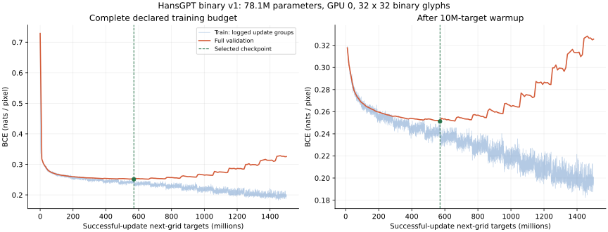
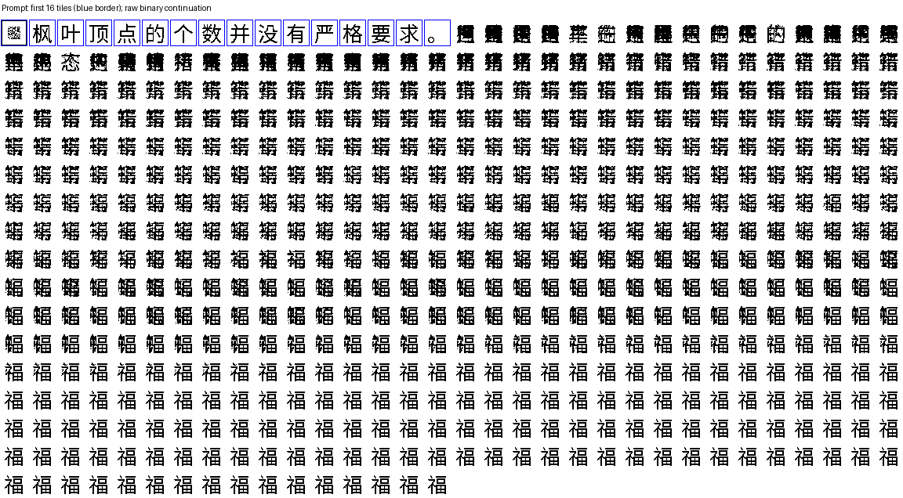
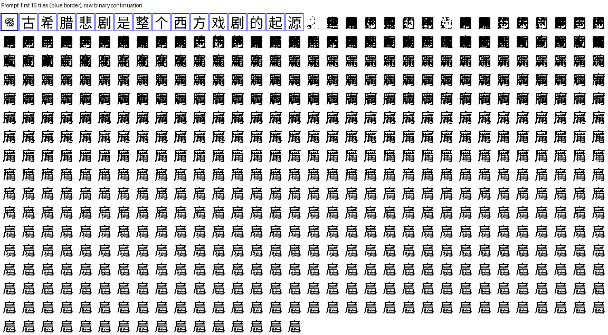
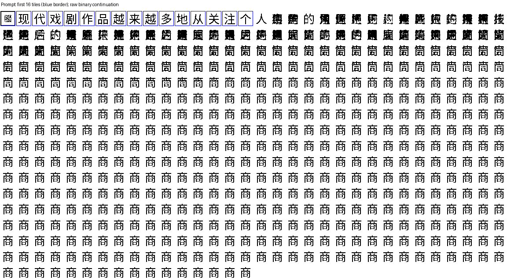

# HansGPT 二值字形 GPT：完整实验结果

实验 `hansgpt_binary_v1` 已完成 ModelScope 数据下载、完整预处理、GPU 0 正式训练和完整留出集评估，流水线退出码为 **0**。每个输入位置是一张 32×32 的 0/1 字形图，输出预测下一张图的 1024 个像素；CNN、因果 Transformer 和像素头共 **78,118,368 个参数**，全部从随机初始化联合训练。

**本次实验验证了这条像素输入／输出训练链路能够运行并学到部分下一格预测，但当前模型尚不能稳定生成连贯、可读的中文。** 给定真实前文时，测试集内容目标的 BCE 比训练像素频率基线降低 **24.00%**，前景 F1 提高 **11.87 个百分点**；纯汉字目标 F1 为 **64.31%**、整格匹配率为 **20.65%**。自由生成使用预测的原始二值图反馈，三例前 128 格分别仅有 **0／0／1 格**精确落入内容字形库，长续写出现混合轮廓和重复塌缩。

本文给出最终结果和解释；完整数据来源、清洗统计、模型结构、环境、许可及复现哈希见 [数据与方法附录](DATA_AND_METHODS.md)。

## 已完成的范围

| 项目 | 实际结果 |
|---|---|
| 数据下载 | 服务器直接从 ModelScope 下载固定版本中文维基六个 Parquet 分片，合计 1,721,150,260 字节，逐文件校验 |
| 完整预处理 | 扫描全部 1,384,748 个源行，保留 915,748 段、87,009,633 个汉字，另含允许标点 |
| 独立训练内容 | 897,245 段，85,236,554 个汉字；每遍 95,660,276 个有效下一格目标 |
| 训练设备 | bee4 的物理 GPU 0，Tesla V100S 32 GiB；FP16 autocast＋GradScaler |
| 声明预算 | 1,500,000,000 个成功更新对应的有效目标，早停关闭 |
| 实际有效目标 | **1,500,017,043**；整组更新边界导致超出 17,043 个 |
| 更新次数 | **54,977** 次有效更新；另有 15 次 AMP 溢出跳过 |
| 尝试／排除目标 | 尝试 1,500,208,570 个；排除 191,527 个，未计入有效预算 |
| 数据遍历 | 完成 15 次数据遍历并进入第 16 次；有效更新量相当于 **15.6807 遍**，尝试量相当于 15.6827 遍 |
| 训练用时 | **45,267.96 秒＝12.5744 小时**，含周期验证和检查点保存 |
| 整体吞吐 | **33,136.39 个有效目标／秒**，包含上述验证及保存开销 |
| 日志局部吞吐 | 更新组吞吐中位数 38,612.13 个目标／秒，不作为整体吞吐替代 |
| 正式运行显存 | 日志记录的 PyTorch 峰值分配 **9,061,114,880 字节＝8.44 GiB**；不含驱动和缓存保留量 |
| 完整验证 | 151 次，每次均覆盖 979,428 个有效目标 |
| 完整测试 | **1,006,022 个有效目标**，包括 897,588 个汉字、99,093 个标点和 9,341 个 EOS 控制格 |
| 自由生成 | 测试序列的前 3 个提示，各续写 512 格，另统计其 32／128 格前缀；全部输出均为 `uint8` 0／1 |

有效目标数不包括 padding 或每段初始 BOS。重复遍历不增加独立语料量。容量预检的峰值分配约 23.24 GiB 属于另一项合成测试，不能替代上表正式运行实测值。

训练完成于北京时间 **2026-09-08 14:38**，停止原因为 `token_budget`，训练模式为 `full`。完整训练计数、AMP 事件和资源统计见 [training_summary.json](training_summary.json)。原始训练完成记录保留 `evaluation_complete:false`，训练摘要也是阶段记录；最终评估状态以独立的 [evaluation_complete.json](evaluation_complete.json) 为准，该凭据为 `complete`。

## 检查点选择与训练曲线

最终评估使用 **第 20,920 次更新、570,838,956 个有效目标处**的检查点，约相当于 5.97 遍有效训练目标、声明预算的 38.06%。选择规则是完整验证 BCE 比已保存值降低超过 `1e-5` 才替换；测试集不参与选择。

| 验证位置 | 完整验证 BCE，nats/pixel |
|---|---:|
| 随机初始化 | 0.729031 |
| 选定检查点 | **0.251172** |
| 完成全部训练预算的最终权重 | 0.325616 |

后期记录的训练批次损失总体呈下降趋势，完整验证损失却明显上升。最终验证 BCE 比选定检查点高 **29.64%**，显示明显的后期泛化退化／过拟合迹象。这不是数值非有限导致的失败：日志中的训练损失、梯度范数和各次完整验证均保持有限。完整预算照预定协议执行，保留了这一负面结果。

蓝线是每十次更新记录的更新组 BCE，橙线是完整验证集均值，两者覆盖范围不同。右图放大预热后的变化；绿线与绿点标记实际用于最终测试的检查点。[PNG 版本](loss_curve.png)、[训练曲线数据](training_curve.csv)和[验证曲线数据](validation_curve.csv)一并提供。

以下测试结果均属于上述选定检查点。没有在测试集上比较最终权重或挑选更好的测试结果，因此不能把这些测试成绩归于训练结束时的 `final.pt`。

## 完整测试集：真实前文条件下的下一格预测

模型二值阈值为 **0.30**，由完整验证集的内容像素 micro F1 在预设网格中选择。对应验证集所有目标 BCE 为 0.251172、F1 为 0.638376；内容目标 F1 为 0.635391。`validation.json` 顶层的阈值型指标使用 0.5，本文阈值 0.3 的验证 F1 取自 `threshold_metrics["0.3"]`。

| 指标 | 全部有效目标 | 内容：汉字＋标点 | 纯汉字目标 | 标点目标 | 控制格：EOS |
|---|---:|---:|---:|---:|---:|
| 目标数 | 1,006,022 | 996,681 | 897,588 | 99,093 | 9,341 |
| BCE，nats/pixel | 0.252146 | 0.252579 | 0.267637 | 0.116182 | 0.205885 |
| NLL，nats/grid | 258.197169 | 258.641133 | 274.060656 | 118.970533 | 210.826359 |
| 前景 precision | 0.532382 | 0.529147 | 0.541842 | 0.223360 | 0.884556 |
| 前景 recall | 0.793660 | 0.791698 | 0.791047 | 0.831706 | 0.946313 |
| 前景 F1／Dice | **0.637280** | **0.634328** | **0.643148** | **0.352148** | **0.914393** |
| IoU | 0.467653 | 0.464481 | 0.474000 | 0.213701 | 0.842287 |
| 整格完全匹配率 | 20.94% | 20.79% | 20.65% | 22.09% | 36.61% |
| Hamming，bits/grid | 163.335692 | 164.456309 | 172.805960 | 88.824872 | 43.766299 |
| 像素准确率，次要指标 | 84.05% | 83.94% | 83.12% | 91.33% | 95.73% |

控制格列由全部目标与内容目标的原始 TP／FP／FN／TN、加权 NLL 和匹配数相减得到，详见 [evaluation_summary.json](evaluation_summary.json) 的 `controls_only_derived`。纯汉字和标点按真实参考标签划分，控制格没有混入正文指标。

| 字形检索诊断 | 全部内容 | 纯汉字目标 | 标点目标 |
|---|---:|---:|---:|
| Hamming 最近字形 Top-1 | 34.99% | **33.39%** | 49.43% |
| Top-5 | 39.49% | 36.19% | 69.41% |
| 预测图精确落入内容字形库 | 24.72% | 24.52% | 26.56% |
| 与最近字形的平均 Hamming bits/grid | 93.38 | 99.19 | 40.70 |

检索在同一个 **11,919 种内容字符**的字形库中进行，汉字与标点分项不会缩小候选集合。它只是诊断输出图和字形资产的距离，不是模型产生的 Unicode 文本，也不反馈给模型；同像素碰撞按最小资产 ID 打破平局。

F1／Dice 是前景像素 micro 指标，BCE 是独立像素条件概率的负对数似然，二者都不是字符语义准确率或字符困惑度。下一字有多种合理延续，单参考的字形匹配和检索不能覆盖开放生成的语义质量。

## 基线比较

全背景基线固定输出全零图，计算 BCE 时使用每像素前景概率 `1e-6`。像素频率基线只统计训练集有效下一格目标，在每个固定像素位置预测训练前景频率；它没有前文条件。

像素频率基线独立在完整验证集内容目标上选择阈值 **0.25**，模型独立选择 **0.30**。两者都在预设 `0.25…0.75` 网格内优化内容 micro F1。基线选中搜索下边界，不声称连续阈值空间的全局最优；BCE 比较不受二值阈值选择影响。

| 受评范围／方法 | BCE，nats/pixel | 前景 F1 | IoU | 整格匹配 |
|---|---:|---:|---:|---:|
| 全部目标：全背景 | 2.439178 | 0.000000 | 0.000000 | 0.00% |
| 全部目标：训练像素频率 | 0.337168 | 0.513969 | 0.345867 | 0.00% |
| 全部目标：HansGPT | **0.252146** | **0.637280** | **0.467653** | **20.94%** |
| 内容目标：全背景 | 2.430807 | 0.000000 | 0.000000 | 0.00% |
| 内容目标：训练像素频率 | 0.332356 | 0.515633 | 0.347375 | 0.00% |
| 内容目标：HansGPT | **0.252579** | **0.634328** | **0.464481** | **20.79%** |
| 纯汉字：全背景 | 2.655932 | 0.000000 | 0.000000 | 0.00% |
| 纯汉字：训练像素频率 | 0.342283 | 0.549514 | 0.378848 | 0.00% |
| 纯汉字：HansGPT | **0.267637** | **0.643148** | **0.474000** | **20.65%** |

内容目标 BCE 相对像素频率基线降低 **24.00%**，F1 提高 **11.87 个百分点**；全部目标 BCE 降低 25.22%。模型确实优于这两个简单基线，但未与同规模字符分类语言模型、其他空间解码头或更大语料训练作对照。

全背景基线也能得到 82.34% 的全部像素准确率，说明大面积背景会使该指标显得较高，因此本文同时报告前景、整格和检索指标。标点及控制格的完整基线数据保留在机器可读结果中。

## 按训练频次分层

频次是该参考标签在一遍训练集中的有效目标出现次数。各层包含汉字和标点，排除控制格；目标数是测试中的出现次数，不是独立字符种数。

| 训练频次 | 测试目标数 | BCE，nats/pixel | 前景 F1 | 整格匹配 | Top-1 | Top-5 |
|---|---:|---:|---:|---:|---:|---:|
| 未见，0 次 | 10 | 0.379518 | 0.593859 | 0.00% | 0.00% | 0.00% |
| 罕见，1–99 次 | 1,095 | 0.372537 | 0.586087 | 0.00% | 3.65% | 7.85% |
| 中频，100–9,999 次 | 75,322 | 0.320624 | 0.619297 | 7.18% | 20.87% | 22.76% |
| 高频，至少 10,000 次 | 920,254 | 0.246866 | 0.635915 | 21.93% | 36.18% | 40.90% |

各层合计 996,681 个内容目标。高频层主导整体结果；未见层只有十次出现，且整格／Top-1／Top-5 均未成功，不能据此建立未见汉字或部件组合泛化结论。

## 自由生成：直接反馈原始二值图

评估固定取测试序列的前三个提示，每条提示 16 格（含初始控制格），各生成 512 格。32／128 格结果是同一条续写的前缀，不是额外独立样本。为观察长程退化，未启用 EOS 停止。输出图均经独立数组检查确认只有 0／1，且没有 OCR 或最近字形修正参与反馈。

| 样本 | 前缀格数 | 精确合法内容图率 | 精确汉字图率 | 精确标点图率 | 最近字形平均 Hamming | 相邻完全重复率 | 不同位图数 |
|---|---:|---:|---:|---:|---:|---:|---:|
| 0 | 32 | 0.00% | 0.00% | 0.00% | 179.41 | 0.00% | 32 |
| 0 | 128 | 0.00% | 0.00% | 0.00% | 159.82 | 0.00% | 128 |
| 0 | 512 | 16.99% | 16.99% | 0.00% | 82.14 | 22.90% | 382 |
| 1 | 32 | 0.00% | 0.00% | 0.00% | 181.06 | 0.00% | 32 |
| 1 | 128 | 0.00% | 0.00% | 0.00% | 173.88 | 0.00% | 128 |
| 1 | 512 | 0.00% | 0.00% | 0.00% | 103.51 | 0.00% | 510 |
| 2 | 32 | 3.13% | 3.13% | 0.00% | 158.41 | 0.00% | 32 |
| 2 | 128 | 0.78% | 0.78% | 0.00% | 105.43 | 0.00% | 128 |
| 2 | 512 | 72.07% | 72.07% | 0.00% | 26.59 | 72.80% | 140 |

前 128 格三例分别只有 0／0／1 格精确命中字形库。样本 2 后期合法率变高，同时重复率升至 72.80%，是退化为重复字形的表现，不能解释成语言生成质量提升。样本 1 虽无精确相邻重复，视觉轮廓已高度相似；少量像素变化会让这个严格重复指标低估视觉退化。

下面显示未经字形库投影的原始二值续写。蓝框为提示，其后的格子全部来自模型。

样本 0 早期为混合笔画轮廓，后期逐渐重复“福”字形。

样本 1 长段落趋于重复的近似轮廓，但没有任何一格精确命中字形库。

样本 2 后期大量重复“商”字形。合法位图不等于内容合理，也不证明句法、事实或对话能力。

这三例是有限诊断，不是广泛提示集的语义评分。JSON 中的最近字形转写仅为诊断文本；`same_reference_diagnostic` 只比较仍有同一参考续文的前缀，其参考覆盖可能短于 512 格，不能当作完整 512 格语义评估。

## 解释与下一步

本次最直接的结论是：**字形 CNN＋因果 Transformer＋独立像素头能改善真实前文条件下的预测，原始二值反馈的自由生成仍不稳定；重复现有小语料训练到完整预算还出现了明显的后期验证退化。**

独立像素似然配合逐像素阈值可能合成多个候选字的混合轮廓；训练时输入真实字形、推理时输入自身预测图，也会带来分布偏移。它们是与现象相符的机制解释，本实验没有做因果消融，不能断言已找出唯一原因。

后续可优先扩大独立中文语料并比较按验证集早停的训练方案；在保持每格 32×32、最终 0／1 输出的前提下，对比带格内像素依赖的解码头，并单独检验原始预测图反馈的稳定性。需要更多提示、多个随机种子及明确的字符／字体留出实验，才能扩大关于泛化或语言能力的结论。

## 文件、身份与完成核验

| 文件 | 内容 |
|---|---|
| [DATA_AND_METHODS.md](DATA_AND_METHODS.md) | 模型、数据、许可、清洗、拆分、字体与方法限制 |
| [reproducibility.json](reproducibility.json) | 实际配置、环境、源分片及模型输入哈希的聚合记录 |
| [training_summary.json](training_summary.json) | 完整训练计数、耗时、资源、AMP 事件及训练哈希审计 |
| [evaluation_summary.json](evaluation_summary.json) | 全部测试／基线／频次／生成诊断，含控制格推导 |
| [test.json](test.json)／[validation.json](validation.json) | 原始完整测试和验证数值 |
| [evaluation_complete.json](evaluation_complete.json) | 评估完成凭据与原始 metrics／报告 SHA-256 |
| [completion_audit.json](completion_audit.json) | 退出码、数据身份、计数分区、指标算术、原始生成二值性核验 |
| [bundle_manifest.json](bundle_manifest.json) | 下载的聚合结果与报告图逐文件 SHA-256 |
| [AUTOGENERATED_REPORT.md](AUTOGENERATED_REPORT.md) | 评估程序原始生成的报告，保留原字节供凭据核对 |

训练与评估均使用 Git 提交 `79b1d17927f10b13e3838a9aa3e5bb4482d374d9`。完整评估数据与训练检查点的配置、manifest、验证凭据及八个模型输入文件哈希一致；训练与评估完成凭据、所选检查点哈希、测试覆盖及原始生成数组均已核验。报告与图表只复制聚合结果，模型和语料保留在服务器。

| 关键身份 | SHA-256 |
|---|---|
| 选定 `best.pt` | `f4fa353811f4b84e117cd3d632f10cb418423204b2b632443bd751bc58310b5f` |
| 最终 `final.pt` | `874254788412c645574d970388e86e9675cfe4d09284f7bfec57d6dac1fc5358` |
| 原始完整评估 `metrics.json` | `9fb44c6f93a2380159b444e2e3cb8d4f7a9d4b2cb3bbd4ec286eeada4c3d00ce` |
| 原始程序报告 | `76ee5e71b7c97c73075c05d489bbd7c362845f780c9fc4fc5bd7b8271f4ffe1f` |

服务器模型目录为 `/root/HansGPT/artifacts/checkpoints/hansgpt_binary_v1/`；完整评估与原始生成 `.npz` 位于 `/root/HansGPT/artifacts/reports/hansgpt_binary_v1/`；原始训练日志位于 `/root/HansGPT/artifacts/logs/hansgpt_binary_v1/`。源数据、位图库、检查点和私有连接配置均未纳入公开报告。
